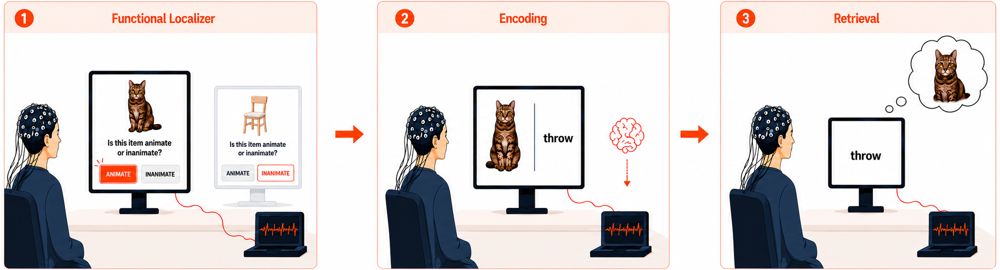

# Memory Reactivation Decoder

A standalone PyQt6 desktop application for decoding memory reactivation from EEG
in real time. It trains a subject-specific decoder offline from a recording,
then runs that decoder live against the incoming EEG stream to read out
reactivation as it happens.

This README has three parts:

1. **[Getting Started](#getting-started)**: install and run.
2. **[User Guide](#user-guide)**: what the app works with, how to configure an
   experiment, and how to operate it.
3. **[Developer Guide](#developer-guide)**: architecture, hardware, and analysis.

---

## Getting Started

### Prerequisites

- **Python 3.10+** (3.11 recommended)
- **Windows** is required for the live LSL stream path
  (`tools/lslproxy/LSLProxy.exe`). Phase 1 and the full test suite work
  on Windows, macOS, Linux, and WSL.

### Install

```bash
cd online_decoder
python -m venv .venv
```

Activate the venv:

- Windows PowerShell: `.venv\Scripts\Activate.ps1`
  (one-time only, if PowerShell blocks the script:
  `Set-ExecutionPolicy -ExecutionPolicy RemoteSigned -Scope CurrentUser`)
- macOS / Linux / WSL: `source .venv/bin/activate`

Then:

```bash
pip install -r requirements-dev.txt
```

`requirements-dev.txt` transitively includes `requirements.txt` (via
the first-line `-r` reference), so this single install covers both the
app's runtime deps and the tooling needed to run tests + debug scripts.
For a strict production-runtime-only install, use
`pip install -r requirements.txt` instead, but you won't be able to
run `pytest` or the `scripts/` helpers.

### Run the app

```bash
# Windows PowerShell
$env:PYTHONPATH = "src"
python -m frontend.main
```

```bash
# macOS / Linux / WSL
PYTHONPATH=src python -m frontend.main
```

---

## User Guide

### Compatibility

The app is not tied to a single experiment. A study is compatible as long as it
is structured so decoders can be trained offline and then run live:



1. **A functional-localizer (training) phase.** The classes you want to decode
   must be presented as tagged stimuli in a dedicated phase, so Phase 1 can train
   one decoder per class from that recording. In the example above, animate vs.
   inanimate images are shown and labeled during the localizer. The trained
   decoders are then read out live during encoding and retrieval.
2. **64 EEG channels + 1 trigger channel, recorded at 1000 Hz.**
3. **Parallel-port triggers.** Events are emitted as parallel-port codes, which
   land in the recording's markers offline and in the trigger channel live.
4. **A BrainVision recording** (`.vhdr` + `.vmrk` + `.eeg`) of the localizer for
   offline training.
5. **A decodable contrast.** Each decoding target must be expressible as a
   positive-vs-negative grouping of trigger labels (see
   [Configuration](#configuration)).

Everything experiment-specific (stimuli, trigger codes, decode targets) is
declared in `experiment_config.yaml`, so adapting the app to a new compatible
study needs no code changes.

### Configuration

A single file, `experiment_config.yaml`, describes the experiment. It is the
only thing you edit to adapt the app to a new compatible study: stimuli, trigger
codes, and decode targets all live here, so no code changes are needed. You pick
the file on the app's Settings screen.

The file is validated on load against the Pydantic schema in
[`src/backend/core/config_models.py`](src/backend/core/config_models.py), and
unknown keys are rejected. It holds only the experiment-specific settings below.
The preprocessing parameters are fixed. See [preprocessing pipeline] for the recipe.

<!-- TODO (step: Preprocessing pipeline): replace the "[preprocessing pipeline]"
reference above with a real link once the preprocessing pipeline doc is created. -->


A minimal, complete config:

```yaml
experiment_info:
  name: My_Study            # free-text label for the run

random_state: 42            # seed for ICA, CV splits, and training (top level only)

markers_mapping:            # every trigger code the experiment emits, code -> name
  events:
    - {id: 11, name: red}
    - {id: 12, name: green}
    - {id: 13, name: yellow}

decoders:
  model: LDA                # LDA | Logistic | SVM
  params:                   # model-dependent, validated per model (see config_models.py)
    solver: lsqr
    shrinkage: auto
  scale_method: standard    # standard | median | null
  cv:
    k: 5                    # cross-validation folds (minimum 2)
  tasks:                    # one binary decoder is trained per task
    - name: red decoder
      pos_labels: [red]
      neg_labels: [green, yellow]
    - name: yellow decoder
      pos_labels: [yellow]
      neg_labels: [green, red]
```

**The keys:**

- **`experiment_info.name`**: a label for the run.
- **`random_state`**: one integer seed, set at the top level only (setting it under
  `decoders` is an error). Drives the ICA fit, CV splits, and training.
- **`markers_mapping.events`**: the trigger-to-event mapping. Each entry maps a
  parallel-port `id` to a `name`. Names are what the decoders refer to.
- **`decoders`**:
  - `model`: `LDA`, `Logistic`, or `SVM`.
  - `params`: model-specific hyperparameters, validated against the allowed keys
    for the chosen model (unknown keys are rejected). See `_VALID_PARAMS_BY_MODEL`
    and the defaults in
    [`config_models.py`](src/backend/core/config_models.py) for the authoritative
    list.
  - `scale_method`: `standard`, `median`, or `null` (no scaling).
  - `cv.k`: number of cross-validation folds (minimum 2).
  - `tasks`: one entry per decoder. Each names a `pos_labels` group and a
    `neg_labels` group. The two must not overlap, and every label must be a name
    from `markers_mapping.events` (or an interval, below).

**Optional: `intervals`.** A class can also be defined by the span between two
markers, rather than a single stimulus. Inside every `[start, stop]` occurrence,
epoch-sized windows are tiled and labeled, and that name becomes usable as a task
label, for example a resting baseline to contrast against stimuli:

```yaml
intervals:
  - name: rest
    start: trial_start      # both must be names mapped in markers_mapping.events
    stop: trial_end
```

### Application User Manual

The **[Application User Manual](docs/guide/user_manual.md)** is a
screen-by-screen walkthrough of operating the app: launch, Phase 1 training
(settings → load → preprocess → evaluate → train), and Phase 2 live inference.

---

## Developer Guide

### Software Architecture

<!-- TODO (step: Architecture): short overview of the decoupled UI/backend
model and the Phase 1 → artifact → Phase 2 data flow, then links out for depth. -->

_Overview to be written._ For now, the maintained references are:

- [docs/architecture/backend_architecture.md](docs/architecture/backend_architecture.md): backend surface & contracts
- [docs/architecture/frontend_layout.md](docs/architecture/frontend_layout.md): frontend structure
- [docs/architecture/stream_worker_design.md](docs/architecture/stream_worker_design.md): live decoder loop design
- [docs/architecture/logging.md](docs/architecture/logging.md): logging conventions
- [CLAUDE.md](CLAUDE.md): repo conventions and how to work in this codebase
- [docs/README.md](docs/README.md): full documentation map

#### Debug Mode

<!-- TODO (step: Architecture): expand on how the debug entry points and seeded
snapshot profiles let you jump straight into any screen without a full pipeline
run. -->

Fast path for iterating on UI screens without sitting through ~5 min of real
preprocessing each time. **One-time seed** from a real recording, then drive the
whole pipeline with **Ctrl+→**.

```bash
python -m scripts.demo_seed_debug_snapshots --data <path/to/subject>
python -m frontend.debug.main
```

See [src/frontend/debug/README.md](src/frontend/debug/README.md) for the full
walkthrough mechanics and [docs/reference/debug_profiles.md](docs/reference/debug_profiles.md)
for the seeded snapshot profiles.

### Testing

```bash
pytest -q --deselect tests/online_phase/test_stream_worker.py
```

Expected: `322 passed, 1 skipped, 11 deselected`.

- The 1 skip is `test_lsl_receiver_integration.py`, gated behind
  `RUN_LSL_INTEGRATION=1`, and runs only against a real LSL stream.
- The 11 deselections are `test_stream_worker.py`, which needs
  `pytest-qt`/`qtbot` and a live LSL outlet. It's not a regression.

### Hardware

<!-- TODO (step: Hardware): the EEG acquisition setup (NeurOne amplifier,
64 EEG + 1 event channel at 1000 Hz, µV on the wire), the LSLProxy bridge, and
the parallel-port trigger interface. New page: docs/guide/hardware.md. -->

_To be written._

### Analysis

<!-- TODO (step: Analysis): how existing data was analyzed and how to reproduce
the project's results (FL / encoding / retrieval replay). -->

_To be written._ See
[tests/notebooks/analysis/README.md](tests/notebooks/analysis/README.md).
