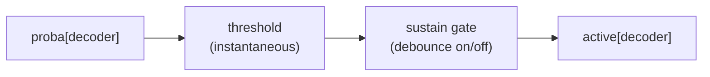
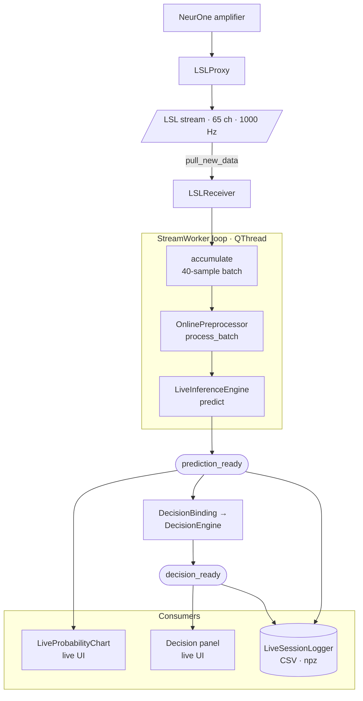

# Backend Architecture

The maintained summary of the `online_decoder` backend: the classes under
`src/backend/`, their contracts, and how data flows from an offline recording to
a trained decoder and then to live inference.

The app has two phases:

- **Phase 1 (offline training)** turns a subject's BrainVision recording into a
  `decoder_pipeline.joblib` artifact: one trained classifier per decode target.
- **Phase 2 (online inference)** loads that artifact and runs it against the live
  EEG stream, emitting per-decoder probabilities and latched on/off decisions in
  real time.

The frontend never touches these classes directly. It talks to one object,
`AppSession`, which composes everything below it.

---

## The `AppSession` entry point

`src/backend/session.py` — `AppSession` is the single entry point the frontend
imports. It owns the `SettingsManager` lifetime and the session's on-disk layout,
and it builds both phases.

Two-stage initialisation:

1. `AppSession(config_path)` loads and validates the experiment config.
   `session.settings` is available immediately.
2. `session.configure_output(output_dir)` sets the workspace (`session.paths`)
   and creates the Phase 1 `OfflineOrchestrator`, exposed as `session.offline`.
   It also copies the config verbatim into the workspace so a run is
   self-documenting.

Key members:

- `session.offline` — the Phase 1 orchestrator (see below), available after
  `configure_output`.
- `session.paths` — a `SessionPaths` (see below), the on-disk layout authority.
- `session.settings` — all config sections as one dict.
- `discover_streams(timeout_sec=3.0)` — ensure the stream source is publishing,
  then return the visible LSL stream names.
- `start_stream_source()` / `stop_stream_source()` — own the live stream source
  lifecycle (the proxy) so the frontend never launches it.
- `build_live_stream_session(...)` — compose a Phase 2 run (below).
- `new_phase2_log_dir()` — create and return a fresh live-log run directory, or
  `None` when no workspace is set (live inference then runs unlogged).
- `decision_config_defaults()` — the initial decision settings as plain values,
  to seed the UI controls.

For a live-only jump (a debug Phase 2 launch or "Open Live from Existing Output"),
`session.paths` is assigned directly and the offline orchestrator is skipped.

### `LiveStreamSession`

`build_live_stream_session` returns a `LiveStreamSession` — the lifecycle wrapper
for one composed live run. It owns start/stop/cleanup of the receiver, worker,
decision binding, and optional logger, and forwards their Qt signals without
exposing internals:

```python
session.build_live_stream_session(
    decoder_pipeline_path,
    log_dir=None,
    batch_size_samples=40,
    *,
    stream_name=None,
    decision_params=None,
) -> LiveStreamSession
```

Signals it forwards: `prediction_ready`, `decision_ready`, `error_occurred`,
`latency_ready`. `update_decision_config(decision_params: dict)` stages new
decision settings (plain values, so the frontend never touches backend types);
`start()` / `stop()` are idempotent.

---

## How files are laid out on disk

`src/backend/core/session_paths.py` — a frozen dataclass rooted at the output
directory. It is the **only** place the directory structure is defined; every
phase derives its locations from it rather than composing path joins:

```text
<root>/
├── experiment_config.yaml       copy of the config this run used
├── epochs/                      cleaned epochs (.fif)
├── evaluation/                  CV results
├── models/
│   └── decoder_pipeline.joblib  the Phase 2 artifact
└── phase2_live/
    └── <run>/                   one directory per live Start (timestamped)
```

Accessors (`epochs_dir`, `models_dir`, `decoder_pipeline_path`, `phase2_live_dir`,
`experiment_config_path`) are pure. `new_phase2_run_dir()` is the one exception:
it creates and returns a fresh timestamped run directory, since callers always
want it to exist.

---

## Configuration and the preprocessing recipe

The experiment config (`experiment_config.yaml`) carries only experiment-specific
settings: `experiment_info`, `random_state`, `markers_mapping`, `decoders`, and
an optional `intervals` block. Its schema is the Pydantic v2 model in
`src/backend/core/config_models.py`; unknown keys are rejected on load.

### From triggers to decode targets

The config is how an experiment maps onto the decoders, with no code changes:

- `markers_mapping.events` maps every parallel-port trigger `id` the experiment
  emits to a `name`. Names are the vocabulary everything else refers to.
- `decoders.tasks` is a list of decode targets, and **one binary classifier is
  trained per task**. Each task names a `pos_labels` group and a `neg_labels`
  group (both drawn from the event names); the two must not overlap. So a task
  like `pos_labels: [face]`, `neg_labels: [house, tool]` trains a
  face-vs-rest decoder.
- `decoders` also fixes the model family (`model` + validated `params`),
  feature scaling (`scale_method`), and cross-validation (`cv.k`).
- `random_state` (top level only) seeds the ICA fit, the CV splits, and training,
  so a run is reproducible.
- The optional `intervals` block defines a class from the span between a start
  and a stop marker rather than a single stimulus. At offline epoching, each
  `[start, stop]` occurrence is tiled into contiguous epoch-sized windows and
  labelled; the interval name then becomes usable as a `pos_labels`/`neg_labels`
  entry like any stimulus. Intervals are offline-only.

### The preprocessing recipe

The **preprocessing recipe is not in the config**. The full recipe — channel
hygiene, high-pass, notch, low-pass, resample/decimate, epoching, and
ICA + ICLabel — is fixed as named constants in
`src/backend/core/preprocessing_constants.py` and imported directly by both
preprocessors. This is what keeps the online path from ever diverging from the
training recipe.

`SettingsManager` (`src/backend/core/settings_manager.py`) loads and validates
the config and exposes it to the rest of the app:

- `get_settings()` returns all sections as one dict (and re-assembles the recipe
  from the constants for the read-only frontend view).
- `get_event_mapping()` flattens `markers_mapping` to `{event_name: trigger_id}`.
- `get_random_state()` exposes the seed for the offline ICA fit and CV splits.

---

## Phase 1: offline training

`src/backend/offline_phase/orchestrator.py` — `OfflineOrchestrator` is the façade
over the Phase 1 backend and the single entry point for the Phase 1 UI. It owns
raw file I/O, holds intermediate state between operator-gated steps, and bundles
the final artifact export. Construction: `OfflineOrchestrator(settings_manager,
paths)`.

The pipeline is split into steps because two operator selections run on MNE's
native interactive windows (which must run on the GUI main thread):

```python
set_file_path(data_dir)
load_raw_data()                                   # I/O — user clicks Load
raw = run_step1a_filter()                         # worker thread
# UI: raw.plot(block=True) → operator marks bad channels
set_bad_channels(raw.info["bads"])                # main thread
ica, epochs, suggested = run_step1b_fit_ica()     # worker thread
# UI: ica.plot_sources(epochs, block=True) → operator toggles excludes
stats = run_step2_apply_and_save(excluded_components)  # worker thread
eval_results = run_evaluation(on_progress=None)   # worker thread
# UI: operator picks + confirms each decoder's timepoint
result = run_training(timepoints)                 # {task_name: seconds}
artifact = get_live_artifact_spec()
```

The collaborators the orchestrator drives:

- `OfflinePreprocessor(data_dir, random_state, raw=None)`
  (`preprocessor.py`) — runs the recipe from the constants; the seed is the only
  tunable. Produces the cleaned epochs saved under `epochs/`. Also builds
  interval epochs from the optional `intervals` block by tiling epoch-sized
  windows inside each `[start, stop]` span.
- `ModelEvaluator` (`evaluator.py`) — temporal-generalization cross-validation.
  Each epoch is a stimulus-locked window, and a classifier is trained and scored
  at every timepoint in that window, producing a decodability-over-time curve per
  decoder. This is what the operator reads to choose the single timepoint each
  decoder will be trained and deployed at (the moment the class is most separable
  post-stimulus).
- `ModelTrainer` (`trainer.py`) — trains one classifier per task at its
  operator-chosen timepoint.
- `utils.py` — shared `build_classifier` and `get_task_data`.

`run_step2_apply_and_save` and `run_training` write to disk via `SessionPaths`.
`get_live_artifact_spec()` returns the validated `DecoderPipelineArtifactSpec`
(next section), which is what the artifact loader reads back in Phase 2.

---

## The artifact: `decoder_pipeline.joblib`

This file is the entire contract between the two phases. Phase 1 produces it;
Phase 2 consumes it and nothing else from the training run. It is a joblib dict
with three keys, defined producer-side by `DecoderPipelineArtifactSpec`
(`core/artifact_models.py`) and read back by `load_decoder_pipeline_artifact`
(`online_phase/artifact_loader.py`) into a `DecoderPipelineArtifact` dataclass.

- **`models`** — `{decoder_name: sklearn.Pipeline}`, one fitted pipeline per
  task, keyed by the task name. `LiveInferenceEngine` calls each directly.
- **`metadata`** — a `DecoderPipelineMetadata`: `feature_width` (the number of
  EEG channels the models expect) and `decoding_timepoints`
  (`{task_name: seconds}`, each decoder's chosen timepoint). `feature_width` is
  cross-checked against `online_state` at export.
- **`online_state`** — the frozen preprocessing state that lets the online
  pipeline reproduce the offline transforms **exactly**, so the features the
  live models see are the same shape and calibration they were trained on. Its
  keys (all positional — no channel names):
  - `eeg_chunk_indices` — which stream channels are the EEG channels.
  - `bad_indices` + `interp_weights` — the bad channels marked offline and the
    precomputed interpolation weights to reconstruct them online.
  - `ica_unmixing` / `ica_mixing` / `ica_pca_components` / `ica_pca_mean` /
    `ica_exclude` — the fitted ICA matrices and the components the operator
    excluded, applied online without re-fitting.
  - `pre_whitener` — the pre-whitening applied before ICA.

Because both preprocessors read the *recipe* from the same constants and the
online path reads the fitted *state* from this artifact, Phase 2 can never
silently diverge from how the decoder was trained.

---

## Phase 2: online inference

`build_live_stream_session` composes these pieces. Each is independently
testable; the worker owns only the micro-batch loop.

### `LSLReceiver` — pure consumer

`online_phase/lsl_receiver.py`. Resolves and pulls from the LSL stream; it never
publishes. It validates the stream on `start()` (stream type `EEG`, name
`NeuroneStream`, exactly 65 channels = 64 EEG + 1 trigger, 1000 Hz) and splits
each pull into `(timestamps, eeg, markers)`, decoding trigger codes off the
trigger channel and emitting one `(timestamp, code)` per rising edge. See
[hardware.md](../guide/hardware.md) for the stream contract and trigger decoding.

### `StreamSource` — making the stream appear

`online_phase/stream_source.py`. Publishing a stream onto the network is a
separate responsibility from consuming it. `StreamSource` is a small protocol
(`start` / `stop` / `is_running`); `LslProxySource` wraps
`tools/lslproxy/LSLProxy.exe` (Windows-only). `AppSession` owns the active source
and reuses it between discovery and the run, so the hardware connection is not
churned.

### `OnlinePreprocessor` — config-independent

`online_phase/online_preprocessor.py`. Constructed as
`OnlinePreprocessor(online_state=artifact.online_state)`. It reads the recipe from
the same constants as Phase 1, so it cannot diverge from the training pipeline.
`process_batch(eeg, timestamps)` applies the recipe (including the µV → SI-volt
scaling the decoder expects) and returns the model-ready features.

### `LiveInferenceEngine`

`online_phase/live_inference.py`. Constructed as
`LiveInferenceEngine(models=artifact.models, metadata=artifact.metadata)`.
`predict(features)` returns a `{decoder_name: probability_vector}` dict.

### `StreamWorker` — the micro-batch loop

`online_phase/stream_worker.py`, a `QThread`. It owns only the loop: pull from the
receiver, accumulate into fixed-size batches (default 40 samples), preprocess,
infer, and emit. Signals:

- `prediction_ready(dict, np.ndarray, list)` — per-decoder probabilities, their
  timestamps, and the batch's markers.
- `latency_ready(dict)` — per-batch timing diagnostics (pull / preprocess /
  inference / sample-to-decision latency, backlog).
- `error_occurred(str)` — a stage failure that stops the loop.

### Decision layer

`online_phase/decision_engine.py` and `decision_binding.py`. The decision layer
turns the probability stream into latched on/off decisions, **per decoder and
independent** (several decoders can be active at once). For each decoder:



- `DecisionConfig` — the immutable tunable rule: a global `threshold`, plus
  `sustain_timepoints` / `release_timepoints` debounce counts (counted in
  timepoints, one per prediction — no sampling frequency involved).
- `DecisionEngine.process_batch(predictions, timestamps)` — threads the latch
  state across batch boundaries and returns a `DecisionResult` (per-sample
  `active` booleans). Live config changes are staged via `set_pending_config`
  and applied at the next batch boundary.
- `DecisionBinding` — the thin Qt layer: a sibling consumer of `prediction_ready`
  (like the logger, connected directly), emitting `decision_ready`. The engine
  itself is pure Python (no Qt, no I/O), so the logic stays unit-testable without
  an event loop.

### `LiveSessionLogger`

`online_phase/session_logger.py`. When `build_live_stream_session` is given a
`log_dir`, this is wired as a direct consumer of `prediction_ready` (and, when
decisions are logged, of `decision_ready`). It is the run's persistent sink. Per
run directory:

```text
<run>/
├── predictions.csv       lsl_timestamp, t_sec, <task1..taskN>
├── markers.csv           lsl_timestamp, t_sec, code, name
├── manifest.json         schema version, wall-clock + lsl_t0, counts, metadata
├── predictions.npz       (written at close) full-precision arrays + manifest
├── decisions.csv         (when decisions are logged) per-sample latches
└── decision_config.jsonl (when decisions are logged) config-version timeline
```

The CSVs are the line-buffered, crash-safe source of truth; the `.npz` is a
full-precision projection written at `close()`. `export_session_npz` rebuilds the
bundle from the CSVs so a run that crashed before `close()` can still be exported.

---

## Live data flow



The flow has a single spine — infer, emit `prediction_ready`, derive decisions,
emit `decision_ready` — and every consumer hangs off one of those two signals.
`prediction_ready` feeds the chart, the logger, and the decision binding;
`decision_ready` feeds the decision panel and the logger. The logger is the one
node fed by both, since it records probabilities and decisions together. Each
consumer is independent and directly connected, so adding or removing one never
touches the worker.

## Lifecycle and error handling

A typical Phase 2 run is: `discover_streams()` (starts the source and lists
streams) → `start_stream_source()` → `build_live_stream_session(...)` →
`LiveStreamSession.start()` → ... → `stop()`. `start()` and `stop()` are
idempotent, and a stopped session cannot be restarted (build a new one).

If any stage in the worker loop raises (pull, preprocess, inference), the worker
stops itself and emits `error_occurred(str)` rather than crashing the UI thread;
`LiveStreamSession.stop()` then unwinds the receiver, logger, and worker cleanly.

## Timing

At the default 40-sample batch on a 1000 Hz stream, the loop emits roughly 25
times per second (a new decision about every 40 ms). `latency_ready` carries
per-batch timing, including `sample_to_decision_ms` (computed from the receiver's
LSL `time_correction`), so end-to-end latency and backlog are observable live;
the worker also logs a rolling mean/p95 summary rather than a line per batch.

## Threading model

Phase 1's long steps run on frontend worker threads; the two interactive MNE
selections run on the GUI main thread (they block on native windows). Phase 2's
`StreamWorker` is a `QThread`; the decision engine mutates its state only on that
worker thread, with `set_pending_config` as the sole cross-thread entry point.
Consumers (chart, logger, decision binding) receive `prediction_ready` via direct
Qt connections.
