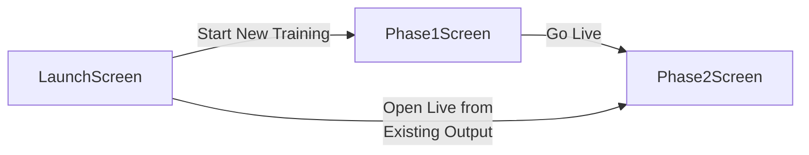
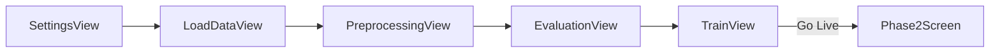

# Frontend Architecture

The maintained summary of the PyQt6 UI under `src/frontend/`: the window shell,
the three screens, the Phase 1 training journey, the Phase 2 live screen, and the
shared machinery (background workers, loading idioms, styling).

The frontend talks to exactly one backend object, `AppSession`. It never imports
backend internals; everything it needs — the offline pipeline, live-stream
composition, stream discovery — comes through that one handle. See
[backend.md](backend.md) for what sits behind it.

---

## The application window

`main.py` is the entry point. It configures logging, selects MNE's Qt browser
backend (so the blocking `raw.plot` / `ica.plot_sources` review windows work
inside the running Qt event loop), applies the global stylesheet, and shows the
launch screen:

```python
app = QApplication(sys.argv)
app.setStyleSheet(GLOBAL_QSS)
window = MainWindow()
window.show_screen(LaunchScreen())
```

`MainWindow` (`main_window.py`) is a single `QMainWindow` (1280×800, min
960×600) whose central widget is a `QStackedWidget`. It holds one screen at a
time; `show_screen(widget)` adds the widget if new and makes it current.
Navigation is **one-way** — screens are pushed forward, and leaving Phase 2 means
restarting the app.

---

## Screen map

Three screens live in `screens/`, reached along two paths:



- **`LaunchScreen`** — the startup pre-screen. Two mutually exclusive entries:
  *Start New Training* opens `Phase1Screen`; *Open Live from Existing Output*
  picks a prior run's output folder and jumps straight to `Phase2Screen`.
- **`Phase1Screen`** — the offline training steps (below). Its final step hands
  off to Phase 2.
- **`Phase2Screen`** — the live-inference screen (below).

The "Open Live" path is built by `screens/phase2_launch.py`:
`missing_live_artifacts(output_dir)` checks the folder has the config and
`models/decoder_pipeline.joblib`, and `build_phase2_from_output(output_dir)`
constructs an `AppSession`, assigns `session.paths` directly (no
`OfflineOrchestrator` — Phase 2 is live-only), and hands it to `Phase2Screen`.

---

## Phase 1: offline training

`screens/phase1_screen.py`. A two-panel layout: a white workspace card on the
left and a fixed `JourneyPanel` sidebar on the right (labelled "Training
Pipeline" in the UI).

```text
Phase1Screen
├── workspace card
│   ├── header bar (title tracks the active node)
│   └── QStackedWidget — one view at a time:
│       [0] SettingsView       Pipeline Settings
│       [1] LoadDataView       Data Ingestion
│       [2] PreprocessingView  Preprocessing
│       [3] EvaluationView     Model Evaluation
│       [4] TrainView          Train & Save
└── JourneyPanel (320px sidebar)
```

All five views are full implementations under `views/`. They run in sequence,
each surfacing its result as a node summary in the sidebar:



### The step contract

`Phase1Screen` owns no pipeline logic — it wires each view to its step in the
sidebar and relays results. Every view exposes the same small surface, so the
wiring is uniform:

- `ready_changed(bool)` → gates that node's action button.
- `loading_requested(str)` / `loading_done` → drive the shared loading overlay.
- a `trigger_*` slot the node's button calls to start that step.
- a completion signal (e.g. `data_loaded`, `preprocessing_complete`,
  `evaluation_complete`, `training_complete`) that advances the sidebar to the
  next step and fills the node summary.

`JourneyPanel` (`widgets/journey_panel.py`) is the sidebar: five `JourneyNode`s
with inactive / active / complete states and a trail line, all drawn in
`paintEvent`. `advance(n)` marks node `n` complete and activates `n+1`;
`set_node_action` / `set_node_action_label` / `set_node_ready` / `set_node_summary`
let the screen re-point a node's button and text as its state changes (for
example, Node 4's button changes from "run evaluation" to "Approve & Continue"
once results are showing).

### Key data the screen carries forward

The operator's per-decoder timepoints chosen on Evaluation
(`{task_name: seconds}`) are stashed and passed to `TrainView`; the
`decoder_pipeline.joblib` path that training emits is stored for the Go-Live
handoff. `_on_go_live` constructs `Phase2Screen(session, decoder_pipeline_path)`
and shows it, surfacing a dialog and staying on Phase 1 if the artifact fails to
load.

---

## Phase 2: the live screen

`screens/phase2_screen.py` is layout glue and lifecycle; each panel is its own
module under `widgets/phase2/`. It owns the `LiveStreamSession` lifecycle.

```text
Phase2Screen
├── Phase2Header            status, target, latency, "choose target"
└── body
    ├── Phase2SettingsPanel decision knobs + decoder show/hide + Start/Halt
    └── chart panel
        ├── DecisionPanel        one latched row per decoder
        ├── LiveProbabilityChart rolling probability trace (pyqtgraph)
        └── FrozenEventView      event-locked snapshot history
```

### Run lifecycle

The publishing source (the proxy) is started as soon as the screen opens, so
NeurOne is connected by the time the operator picks a target or clicks Start. The
`LiveStreamSession` itself is built **lazily on each Start** and is one-shot (a
stopped session is discarded, a new one built next Start):

1. **Choose target** — `TargetSelectionDialog` (from `session.discover_streams()`)
   picks the live LSL stream. Start doubles as "pick, then start" if no target is
   set.
2. **Start** — reset the charts, ensure the source is up, allocate a log dir
   (`session.new_phase2_log_dir()`), call
   `session.build_live_stream_session(..., stream_name=..., decision_params=...)`,
   wire its signals, and `start()`.
3. **Signals** are connected with **queued** connections so the slots run on the
   UI thread regardless of the worker thread they were emitted from:
   `prediction_ready` feeds both charts, `decision_ready` feeds the decision
   panel, `latency_ready` feeds the header's latency label, and `error_occurred`
   halts and shows a dialog.
4. **Halt / error / close** all route through one idempotent `_safely_stop()`.
   The source is kept alive across Start/Halt cycles and only torn down when the
   screen closes.

### Decision controls

`Phase2SettingsPanel` edits the decision settings (apply-gated). On apply, the
threshold line moves on both charts and, if a run is live, the new settings are
staged via `LiveStreamSession.update_decision_config` (they take effect on the
next batch and are logged). The same values seed the next run built from Start.

The remaining `widgets/phase2/` modules: `Phase2Header` (`header.py`),
`Phase2SettingsPanel` (`settings_panel.py`), `StartHaltButton`
(`start_halt_button.py`), `DecisionPanel` (`decision_panel.py`), `FrozenEventView`
+ `FrozenEventChart` (`frozen_event_view.py`, `frozen_event_chart.py`), and
`TargetSelectionDialog` (`target_dialog.py`).

---

## Background workers

`workers/`. Any backend call long enough to freeze the UI runs on a `QThread`
worker, built on `base_worker.py`. There is one per heavy step:
`config_loader_worker`, `load_worker`, `preprocessing_worker`,
`evaluation_worker`, `training_worker`, and `stream_discovery_worker`. Each emits
progress/result/error signals the owning view relays.

The exception is deliberate: the two interactive MNE selections (bad-channel
review and ICA-component review) block on native Qt windows that **must** run on
the GUI main thread, so `PreprocessingView` drives them there rather than on a
worker (this is why the pipeline is split into operator-gated steps in
`OfflineOrchestrator`).

---

## Charts

- **Phase 1 (matplotlib)** — `widgets/charts/`: `auc_chart.py`, `tgm_chart.py`
  (temporal-generalization matrix), and `topomap_widget.py`, used by
  `EvaluationView` and `TrainView`.
- **Phase 2 (pyqtgraph)** — `widgets/live_probability_chart.py`, a
  ring-buffered rolling trace built for the live update rate. `pyqtgraph` is a
  runtime dependency scoped to Phase 2; Phase 1 stays on matplotlib.

`LiveProbabilityChart` resolves each trigger code to its configured event name
(from the inverted `event_mapping`) and **drops any code not in
`markers_mapping.events`**, so only configured events are drawn.

---

## Shared widgets and styling

`widgets/shared.py` holds cross-view widgets: `FilePicker` (a button plus the
selected path, emitting `path_selected`) and `ReadOnlyField` (a bordered
read-only value box used for the settings view's read-only recipe display).
`widgets/logo.py` and `widgets/loading_overlay.py` round out the shared set.

Styling lives in `styles/theme.py`:

- Named colour constants (`BG_LIGHT`, `CARD_WHITE`, `BORDER_GRAY`,
  `PRIMARY_BLUE`, `SUCCESS_GREEN`, `TEXT_PRIMARY`, `TEXT_MUTED`, `ALERT_RED`,
  `AMBER`).
- `CHART_LINE_COLORS` + `chart_line_color(index)` — the decoder-line palette,
  deliberately avoiding red/green/blue/yellow so a decoder named "red" never gets
  a red line, and reserving blue for the selected-timepoint markers.
- `GLOBAL_QSS` — the app stylesheet: `primary` / `secondary` button classes and
  the flat underline tab style.
- `progress_bar_qss` and `build_app_palette` helpers.

---

## Debug entry points

`frontend/debug/` lets you jump straight into any screen without a full pipeline
run. `debug/main.py` (with `--phase2`) plus the per-screen harnesses
(`launch_screen_debug.py`, `phase1_screen_debug.py`, `phase2_screen_debug.py`)
build a screen from a seeded snapshot profile (`profiles.py`), mirroring the
production construction paths. See `src/frontend/debug/README.md` for the
walkthrough mechanics.
