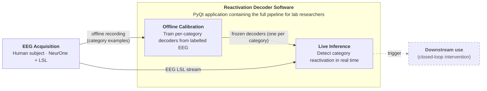
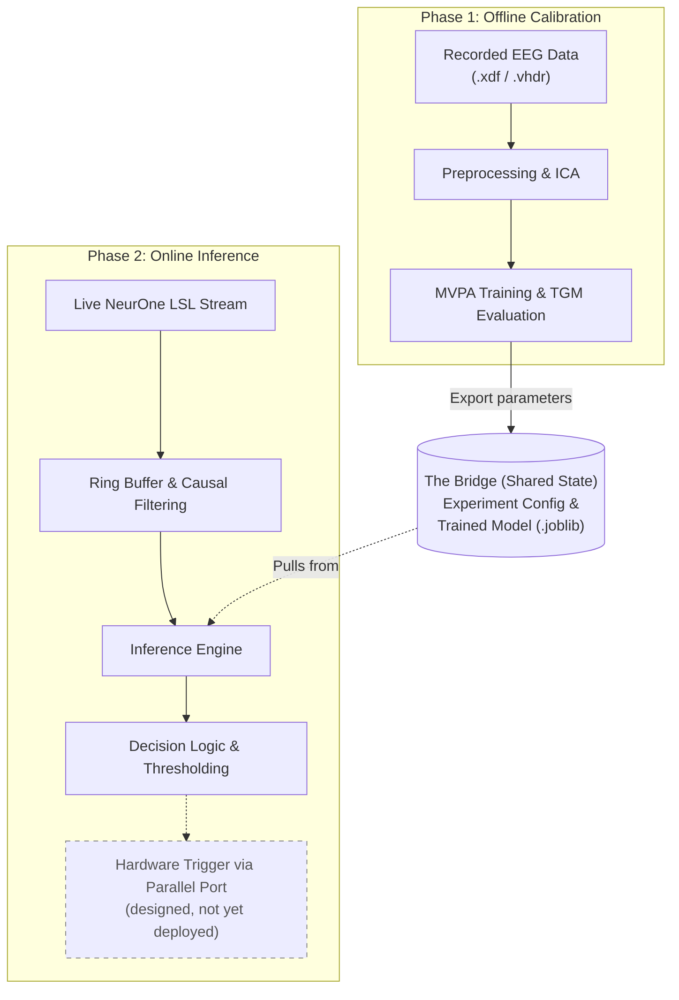

# **Reactivation Decoder Diagrams: Blueprints & Renderings**

This document contains the structural blueprints, purposes, and Mermaid rendering code for the project book diagrams.

## Regenerating the diagram images

Every ```` ```mermaid ```` block below can be exported to PNG with [mermaid-cli](https://github.com/mermaid-js/mermaid-cli) reading **this Markdown file directly** — no separate `.mmd` files to maintain. From the repo root (PowerShell):

```powershell
npx -p @mermaid-js/mermaid-cli mmdc -i "docs/diagrams/Project Diagrams Blueprints.md" -o "docs/diagrams/fig.png" -b white -s 3
```

This emits one PNG per diagram, numbered in document order: `fig-1.png` (Figure 1), `fig-2.png` (Figure 2), and so on. Flags: `-b white` gives a white background (blends into a Google Doc / report page), `-s 3` renders at 3× for crisp text — raise it for higher resolution. To place a diagram in Google Docs (which cannot render Mermaid natively), export the PNG and use **Insert → Image → Upload from computer**.

Requirements: Node.js on PATH (`npx` fetches mermaid-cli on first run). Keep each ```` ```mermaid ```` block free of trailing whitespace — mermaid-cli's Markdown reader errors on trailing spaces inside a fenced block.

## **Figure 1: Conceptual Block Diagram**

**Location:** Abstract / Introduction

**Purpose:** An executive summary diagram showing the complete scope of the engineering work. Target audience is a general reviewer who needs to understand the entire system at a glance.

### **Blueprint Outline**

* **Left — EEG Acquisition (single block):** Human subject + NeurOne amplifier + LSL. Two outgoing arrows:
  * *Arrow 1 (to Offline Calibration):* Offline recording (category examples)
  * *Arrow 2 (to Live Inference):* EEG LSL stream
* **Center — Reactivation Decoder Software** (container; subtitle *"PyQt application containing the full pipeline for lab researchers"*): two inner boxes forming the spine —
  * Offline Calibration — *Train per-category decoders from labelled EEG*; emits the **frozen decoders (one per category)** into…
  * Live Inference — *Detect category reactivation in real time*; receives the LSL stream and the frozen decoders, and emits the trigger.
  * The acquisition's two arrows land **directly on the inner boxes** (offline recording → Offline Calibration, LSL → Live Inference), and the trigger exits **from the Live Inference box**.
* **Right — Trigger output:** Digital trigger emitted by Live Inference, available for downstream closed-loop use (drawn dashed — designed, not yet deployed).

> **Fidelity notes.** Labels follow the abstract/codebase: (1) the abstract does not use "functional localizer," so the training arrow is described plainly as "offline recording (model training)"; (2) the downstream *use* of the trigger is **future work** — the abstract says the action-driven trigger "was not used in practice yet," and `src/` has no hardware-trigger emission — so that leg is dashed; (3) the **offline → frozen-decoder → live** handoff (the project's core novelty) is the container's internal spine.
>
> **Layout note.** The inner boxes are laid out left-to-right (not stacked) on purpose: attaching the external arrows to the *inner* boxes requires the subgraph to inherit the parent `LR` direction. Giving the subgraph its own `direction TB` (to stack the boxes vertically) makes Mermaid re-route every crossing edge to the **container border** instead of the boxes — verified with mermaid-cli — which is the exact problem this layout avoids. The `%%{init: … subGraphTitleMargin …}%%` directive reserves vertical space below the container's two-line title so it doesn't overlap the inner boxes; increase `bottom` if the title still crowds them in your renderer.

### **Mermaid Rendering**



## **Figure 2: Architectural Diagram**

**Location:** Section 3.1 (High-Level System Overview)

**Purpose:** Blueprint showing the detailed data flow and the two distinct operating phases for an engineering audience.

### **Blueprint Outline**

* **Phase 1 Area (Offline Calibration):**  
  * **Box:** Recorded EEG Data (.xdf / .vhdr)  
  * **Box:** Preprocessing & ICA  
  * **Box:** MVPA Training & TGM Evaluation  
  * *Arrow linking to the bridge:* Export parameters  
* **The Bridge (Shared State):**  
  * **Database/File Icon:** Experiment Config & Trained Model (.joblib)  
* **Phase 2 Area (Online Inference):**  
  * **Box:** Live NeurOne LSL Stream  
  * **Box:** Ring Buffer & Causal Filtering  
  * **Box:** Inference Engine (pulls from The Bridge)  
  * **Box:** Decision Logic & Thresholding  
  * **Box:** Hardware Trigger via Parallel Port

### **Mermaid Rendering**


