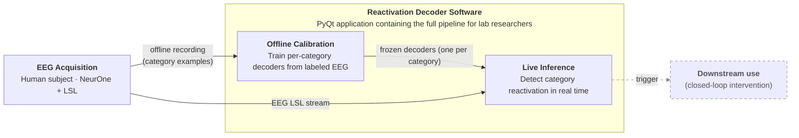
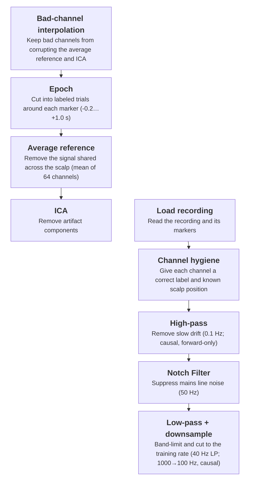
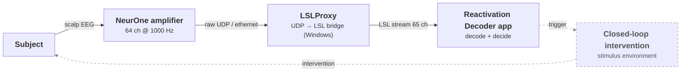

# **Reactivation Decoder Diagrams: Blueprints & Renderings**

This document contains the structural blueprints, purposes, and Mermaid rendering code for the project book diagrams.

## Regenerating the diagram images

Every ```` ```mermaid ```` block below can be exported to PNG with [mermaid-cli](https://github.com/mermaid-js/mermaid-cli) reading **this Markdown file directly** — no separate `.mmd` files to maintain. From the repo root (PowerShell):

```powershell
npx -p @mermaid-js/mermaid-cli mmdc -i "docs/diagrams/Project Diagrams Blueprints.md" -o "docs/diagrams/fig.png" -b white -s 3
```

This emits one PNG per diagram, numbered in document order: `fig-1.png` (Figure 1), `fig-2.png` (Figure 2), and so on. Flags: `-b white` gives a white background (blends into a Google Doc / report page), `-s 3` renders at 3× for crisp text — raise it for higher resolution. To place a diagram in Google Docs (which cannot render Mermaid natively), export the PNG and use **Insert → Image → Upload from computer**.

Requirements: Node.js on PATH (`npx` fetches mermaid-cli on first run). Keep each ```` ```mermaid ```` block free of trailing whitespace — mermaid-cli's Markdown reader errors on trailing spaces inside a fenced block.

## **Figure 1: Conceptual Block Diagram**

**Location:** Abstract / Introduction

**Purpose:** An executive summary diagram showing the complete scope of the engineering work. Target audience is a general reviewer who needs to understand the entire system at a glance.

### **Blueprint Outline**

* **Left — EEG Acquisition (single block):** Human subject + NeurOne amplifier + LSL. Two outgoing arrows:
  * *Arrow 1 (to Offline Calibration):* Offline recording (category examples)
  * *Arrow 2 (to Live Inference):* EEG LSL stream
* **Center — Reactivation Decoder Software** (container; subtitle *"PyQt application containing the full pipeline for lab researchers"*): two inner boxes forming the spine —
  * Offline Calibration — *Train per-category decoders from labeled EEG*; emits the **frozen decoders (one per category)** into…
  * Live Inference — *Detect category reactivation in real time*; receives the LSL stream and the frozen decoders, and emits the trigger.
  * The acquisition's two arrows land **directly on the inner boxes** (offline recording → Offline Calibration, LSL → Live Inference), and the trigger exits **from the Live Inference box**.
* **Right — Trigger output:** Digital trigger emitted by Live Inference, available for downstream closed-loop use (drawn dashed — designed, not yet deployed).

> **Fidelity notes.** Labels follow the abstract/codebase: (1) the abstract does not use "functional localizer," so the training arrow is described plainly as "offline recording (model training)"; (2) the downstream *use* of the trigger is **future work** — the abstract says the action-driven trigger "was not used in practice yet," and `src/` has no hardware-trigger emission — so that leg is dashed; (3) the **offline → frozen-decoder → live** handoff (the project's core novelty) is the container's internal spine.
>
> **Layout note.** The inner boxes are laid out left-to-right (not stacked) on purpose: attaching the external arrows to the *inner* boxes requires the subgraph to inherit the parent `LR` direction. Giving the subgraph its own `direction TB` (to stack the boxes vertically) makes Mermaid re-route every crossing edge to the **container border** instead of the boxes — verified with mermaid-cli — which is the exact problem this layout avoids. The `%%{init: … subGraphTitleMargin …}%%` directive reserves vertical space below the container's two-line title so it doesn't overlap the inner boxes; increase `bottom` if the title still crowds them in your renderer.

### **Mermaid Rendering**



## **Figure 2: Architectural Diagram**

**Location:** Section 3.1 (High-Level System Overview)

**Purpose:** Blueprint showing the detailed data flow and the two distinct operating phases for an engineering audience.

### **Blueprint Outline**

* **Phase 1 lane (Offline Calibration), left→right:**
  * Recorded EEG (.xdf / .vhdr)
  * Preprocessing & ICA
  * MVPA Training & TGM
  * Model Evaluation & Selection — *operator picks the decoding time-point*
* **Hand-off — Decoder Pipeline (`decoder_pipeline.joblib`):** a document-shaped artifact sitting between the two lanes, bundling per-task decoders + frozen preprocessing operators + decoding time-points. Phase 1 *exports* it; Phase 2 *loads* it.
* **Phase 2 lane (Online Inference), left→right:**
  * Live LSL Stream
  * Causal, stateful filtering
  * Inference Engine
  * Decision Logic & Thresholding — emits the trigger
* **Output — Closed-loop intervention (stimulus environment):** outside the Phase 2 lane, reached by a dashed *trigger* arrow (designed, not yet deployed — mirrors Figure 1).

> **Layout note.** Two horizontal swimlanes stacked vertically (parent `TB`, each lane `direction LR`); the hand-off flows straight down through the `Decoder Pipeline`. The pipeline attaches at the Phase-2 *lane* level because it provisions the whole online phase — the frozen operators feed the causal filtering and the decoders feed inference — which also sidesteps the inner-box border-attachment issue for the cross-lane edge. The pipeline uses Mermaid's `doc` (document) shape so it reads as a saved file, not a datastore.

### **Mermaid Rendering**



```mermaid
---
config:
  flowchart:
    subGraphTitleMargin:
      top: 6
      bottom: 16
    rankSpacing: 30
    nodeSpacing: 30
---
flowchart TB
    subgraph P1["<span style='font-size:20px'><b>Phase 1 - Offline Calibration</b></span>"]
        direction LR
        Data1["<span style='font-size:20px'><b>Recorded EEG</b></span><br>Labeled functional-localizer recording with category markers"]
        Pre1["<span style='font-size:20px'><b>Preprocessing & ICA</b></span><br>Epoch · channel hygiene · causal band-pass · 50 Hz notch · downsample · interpolate bad channels · average reference · ICA"]
        Train1["<span style='font-size:20px'><b>MVPA Training & TGM</b></span><br>Per task: classifier trained at every timepoint (5-fold CV, AUC) → temporal-generalization matrix"]
        Sel1["<span style='font-size:20px'><b>Model Evaluation & Selection</b></span><br>Operator picks each decoder's timepoint (TGM diagonal peak). Final decoder fitted at that slice"]
        Data1 --> Pre1 --> Train1 --> Sel1
    end

    Pipe@{ shape: doc, label: "<span style='font-size:20px'><b>Decoder Pipeline (decoder_pipeline.joblib)</b></span><br>per-task decoders · frozen preprocessing operators · decoding time-points" }

    subgraph P2["<span style='font-size:20px'><b>Phase 2 - Online Inference</b></span>"]
        direction LR
        Stream2["<span style='font-size:20px'><b>Live LSL Stream</b></span><br>65-channel LSL @ 1000 Hz (64 EEG + 1 event channel); non-blocking reads"]
        Filt2["<span style='font-size:20px'><b>Causal, stateful filtering</b></span><br>40-sample micro-batches; filters carry state across batches; frozen spatial operators replayed exactly"]
        Inf2["<span style='font-size:20px'><b>Inference Engine</b></span><br>Stateless - applies each frozen decoder to the batch → per-task reactivation probabilities"]
        Dec2["<span style='font-size:20px'><b>Decision Logic & Thresholding</b></span><br>Fires the trigger when a decoder stays above threshold for a sustained interval"]
        Stream2 --> Filt2 --> Inf2 --> Dec2
    end

    Interv["<span style='font-size:20px'><b>Closed-loop intervention</b></span><br>Reactivation cue time-locked to the trigger"]

    Sel1 -->|export| Pipe
    Pipe -->|load| P2
    Dec2 -->|trigger| Interv

    classDef future stroke:#888,stroke-dasharray: 5 5,color:#555;
    class Interv future;
    linkStyle 8 stroke:#888,stroke-dasharray: 5 5;
```

## **Figure 3: Offline Preprocessing Pipeline**

**Location:** §3.2.1 (Offline Preprocessing and Training — "Preprocessing Deep Dive").

**Purpose:** Show the offline preprocessing recipe as an ordered pipeline — one box per step, each leading with the *why* (key numbers in parentheses), in the actual `OfflinePreprocessor` order. Deeper altitude than Figure 2's single "Preprocessing & ICA" block.

### **Blueprint Outline**

* **Layout:** horizontal serpentine — steps 1–5 left→right on the top row, wrapping down to steps 6–9 running right→left on the bottom row (invisible row containers).
* **Stages** (actual `OfflinePreprocessor` order; each description leads with the *why*, numbers in parentheses):
  1. Load recording — read the recording and its markers (BrainVision; EEG channels only).
  2. Channel hygiene — ensure known electrode positions (fix labels; drop non-cortical; montage).
  3. High-pass — remove slow drift (0.1 Hz; causal, forward-only).
  4. Notch Filter — suppress mains line noise (50 Hz).
  5. Low-pass + downsample — band-limit and cut to the training rate (40 Hz LP; 1000 → 100 Hz, causal).
  6. Bad-channel interpolation — reconstruct operator-marked bad channels (spherical spline).
  7. Epoch — cut into labeled trials around each marker (−0.2 … +1.0 s). **Epoching is late** — after filtering and interpolation, not at ingestion.
  8. Average reference — remove the signal shared across the scalp (mean of 64 channels).
  9. ICA — remove artifact components (extended-infomax; ICLabel-suggested, operator-confirmed).
* **Alignment & connector:** the two rows are **right-aligned** — row 2 is padded on the left with an invisible ghost box so its right edge matches row 1, putting Bad-channel interpolation directly under Low-pass + downsample. Mermaid can't attach a cross-row edge to a node (it docks to the row region), so the wrap arrow (Low-pass + downsample → Bad-channel interpolation) is drawn by hand after export.

### **Mermaid Rendering**



---

# Planned Implementation Diagrams (descriptions only — Mermaid TBD)

The figures below cover the Implementation chapter (§3.2–§3.3). They are described here first so we can agree scope and altitude before drawing; each keeps a distinct job so they don't duplicate Figure 2's overview. Numbering is internal to this blueprint and will be reconciled with the report's final figure numbers later.

## **Figure 4: Online Real-Time Inference Loop**

**Location:** §3.2.2 (Online Live Inference).

**Purpose:** Show the live loop and its threading — from LSL ingestion to trigger, logging, and UI update — at ~25 Hz micro-batches. Deeper altitude than Figure 2's Phase-2 lane.

### **Blueprint Outline**

* **Ingestion:** LSL stream (65 ch @ 1000 Hz) → non-blocking read on a dedicated background thread.
* **Event split:** channel 65 (event channel) → rising-edge decode of packed parallel-port codes → markers, timestamped against the network clock.
* **Batching:** fixed micro-batches of 40 raw samples (~25 updates/s); causal filters carry state across batch boundaries.
* **Preprocessing:** applies the frozen operators (Figure 3) to each batch.
* **Inference Engine:** per-task decoder → target-class probability (stateless).
* **Decision Logic:** threshold + sustained-interval criterion → emits the trigger **within** the online stage.
* **Outputs:** trigger → closed-loop intervention (external, dashed — mirrors Figure 1); probabilities → queued channel → UI (ring buffer + timer repaint); session logger (predictions / markers / triggers).
* **Threading note:** background stream thread vs UI thread, decoupled by the queued channel.

### **Mermaid Rendering**

_To be built._

## **Figure 5: Hardware / Signal Path**

**Location:** §3.3 (Hardware Description).

**Purpose:** Convey the closed-loop hardware signal path end to end. **Placeholder** — this Mermaid ring exists only to show the flow and is intended to be replaced with a real hardware image/diagram in the report.

### **Blueprint Outline**

* **Ring (closed loop):** Subject → NeurOne amplifier (64 ch @ 1000 Hz) → LSLProxy (UDP → LSL bridge, Windows) → Reactivation Decoder app → *(dashed)* Closed-loop intervention (stimulus environment) → back to the Subject.
* **Solid = live acquisition path; dashed = the designed-but-not-deployed closed-loop leg** (trigger → intervention → subject), mirroring the dashed "downstream use" in Figures 1–2.
* **Omitted for clarity:** the marker path in (Stimulus PC → parallel-port event codes → amplifier event channel, ch 65) — described in the §3.3 prose; can be added to the ring if wanted.
* **Note:** LSLProxy + its drivers are Windows components, so live acquisition is Windows-only.

### **Mermaid Rendering**



### **Prompt for a realistic version (image generation)**

Use this to generate the real image that replaces the placeholder above — keep the same flow and labels, but draw realistic component illustrations instead of plain boxes:

> Create a clean flat-vector technical diagram of a closed-loop EEG brain–computer-interface signal path, laid out left-to-right and looping back to the start. Use simplified but realistic illustrations of each component (not plain rectangles), joined by labeled arrows:
> 1. **Subject** — a person wearing a 64-channel EEG cap with scalp electrodes.
> 2. → *scalp EEG (64 ch)* → **NeurOne amplifier** — a small research EEG amplifier unit with a bundle of electrode cables.
> 3. → *raw UDP / Ethernet* → **Acquisition PC running LSLProxy** — a desktop computer with a small "Windows" tag.
> 4. → *LSL stream (65 ch)* → **Reactivation Decoder app** — a laptop whose screen shows a live probability chart.
> 5. ⇢ *trigger (parallel port)* ⇢ **Closed-loop intervention** — a stimulus monitor / experiment PC showing a cue.
> 6. ⇢ *intervention / stimulus* ⇢ back to the **Subject**, closing the loop.
>
> Draw steps 5–6 (the closed-loop leg) faded / dashed to signal "designed, not yet deployed". Style: modern 2-D or isometric schematic, muted lavender-blue palette to match the abstract diagram, clear labels, white background, no photorealism — it must still read as a system flow diagram.

## **Figure 6 (optional): UI / Threading Architecture**

**Location:** §3.2.3 (The User Interface). Nice-to-have — the prose stands on its own; include only if we want the threading model drawn.

**Purpose:** Show the supervising-coordinator / session-as-gateway structure and how heavy work stays off the UI thread.

### **Blueprint Outline**

* **Gateway:** `AppSession` is the single boundary to the backend; a thin main window hosts a stack of screens (Phase1Screen, Phase2Screen); views/controls never reach past the session.
* **Phase 1:** each long task (load, preprocess, cross-validate, train) runs in a worker on its own thread, reporting via async messages.
* **Phase 2:** streaming loop on a background thread emits prediction/latency/error messages; a queued channel hands them to the UI thread, whose handlers only copy into ring buffers; a timer drives repaint — decoupling the ~25 Hz data rate from the display.

### **Mermaid Rendering**

_To be built._
