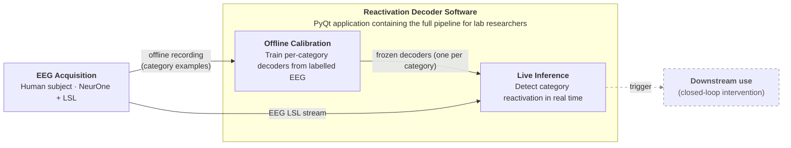
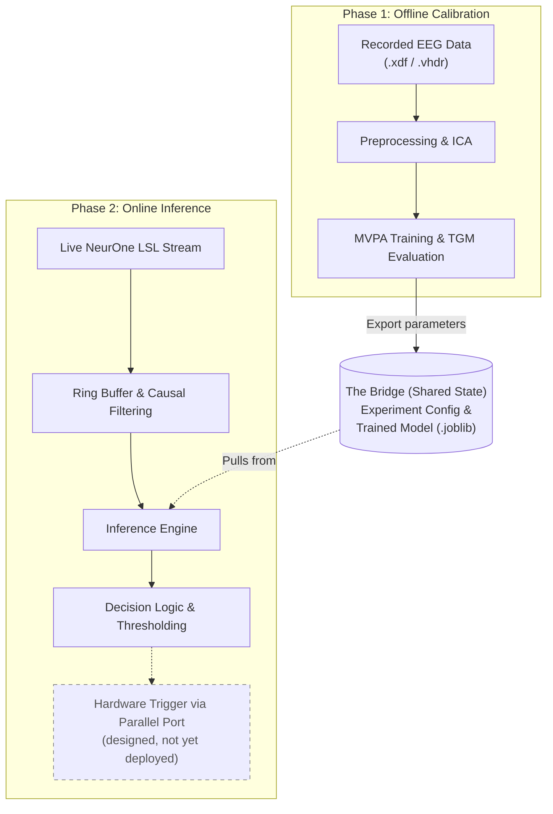

# **Reactivation Decoder Diagrams: Blueprints & Renderings**

This document contains the structural blueprints, purposes, and Mermaid rendering code for the project book diagrams.

## Regenerating the diagram images

Every ```` ```mermaid ```` block below can be exported to PNG with [mermaid-cli](https://github.com/mermaid-js/mermaid-cli) reading **this Markdown file directly** — no separate `.mmd` files to maintain. From the repo root (PowerShell):

```powershell
npx -p @mermaid-js/mermaid-cli mmdc -i "docs/diagrams/Project Diagrams Blueprints.md" -o "docs/diagrams/fig.png" -b white -s 3
```

This emits one PNG per diagram, numbered in document order: `fig-1.png` (Figure 1), `fig-2.png` (Figure 2), and so on. Flags: `-b white` gives a white background (blends into a Google Doc / report page), `-s 3` renders at 3× for crisp text — raise it for higher resolution. To place a diagram in Google Docs (which cannot render Mermaid natively), export the PNG and use **Insert → Image → Upload from computer**.

Requirements: Node.js on PATH (`npx` fetches mermaid-cli on first run). Keep each ```` ```mermaid ```` block free of trailing whitespace — mermaid-cli's Markdown reader errors on trailing spaces inside a fenced block.

## **Figure 1: Conceptual Block Diagram**

**Location:** Abstract / Introduction

**Purpose:** An executive summary diagram showing the complete scope of the engineering work. Target audience is a general reviewer who needs to understand the entire system at a glance.

### **Blueprint Outline**

* **Left — EEG Acquisition (single block):** Human subject + NeurOne amplifier + LSL. Two outgoing arrows:
  * *Arrow 1 (to Offline Calibration):* Offline recording (category examples)
  * *Arrow 2 (to Live Inference):* EEG LSL stream
* **Center — Reactivation Decoder Software** (container; subtitle *"PyQt application containing the full pipeline for lab researchers"*): two inner boxes forming the spine —
  * Offline Calibration — *Train per-category decoders from labelled EEG*; emits the **frozen decoders (one per category)** into…
  * Live Inference — *Detect category reactivation in real time*; receives the LSL stream and the frozen decoders, and emits the trigger.
  * The acquisition's two arrows land **directly on the inner boxes** (offline recording → Offline Calibration, LSL → Live Inference), and the trigger exits **from the Live Inference box**.
* **Right — Trigger output:** Digital trigger emitted by Live Inference, available for downstream closed-loop use (drawn dashed — designed, not yet deployed).

> **Fidelity notes.** Labels follow the abstract/codebase: (1) the abstract does not use "functional localizer," so the training arrow is described plainly as "offline recording (model training)"; (2) the downstream *use* of the trigger is **future work** — the abstract says the action-driven trigger "was not used in practice yet," and `src/` has no hardware-trigger emission — so that leg is dashed; (3) the **offline → frozen-decoder → live** handoff (the project's core novelty) is the container's internal spine.
>
> **Layout note.** The inner boxes are laid out left-to-right (not stacked) on purpose: attaching the external arrows to the *inner* boxes requires the subgraph to inherit the parent `LR` direction. Giving the subgraph its own `direction TB` (to stack the boxes vertically) makes Mermaid re-route every crossing edge to the **container border** instead of the boxes — verified with mermaid-cli — which is the exact problem this layout avoids. The `%%{init: … subGraphTitleMargin …}%%` directive reserves vertical space below the container's two-line title so it doesn't overlap the inner boxes; increase `bottom` if the title still crowds them in your renderer.

### **Mermaid Rendering**



## **Figure 2: Architectural Diagram**

**Location:** Section 3.1 (High-Level System Overview)

**Purpose:** Blueprint showing the detailed data flow and the two distinct operating phases for an engineering audience.

### **Blueprint Outline**

* **Phase 1 Area (Offline Calibration):**  
  * **Box:** Recorded EEG Data (.xdf / .vhdr)  
  * **Box:** Preprocessing & ICA  
  * **Box:** MVPA Training & TGM Evaluation  
  * *Arrow linking to the bridge:* Export parameters  
* **The Bridge (Shared State):**  
  * **Database/File Icon:** Experiment Config & Trained Model (.joblib)  
* **Phase 2 Area (Online Inference):**  
  * **Box:** Live NeurOne LSL Stream  
  * **Box:** Ring Buffer & Causal Filtering  
  * **Box:** Inference Engine (pulls from The Bridge)  
  * **Box:** Decision Logic & Thresholding  
  * **Box:** Hardware Trigger via Parallel Port

### **Mermaid Rendering**



---

# Planned Implementation Diagrams (descriptions only — Mermaid TBD)

The figures below cover the Implementation chapter (§3.2–§3.3). They are described here first so we can agree scope and altitude before drawing; each keeps a distinct job so they don't duplicate Figure 2's overview. Numbering is internal to this blueprint and will be reconciled with the report's final figure numbers later.

## **Figure 3: Offline Preprocessing Pipeline**

**Location:** §3.2.1 (Offline Preprocessing and Training — "Preprocessing Deep Dive").

**Purpose:** Show the fixed offline preprocessing recipe as an ordered pipeline and mark which fitted operators are extracted ("frozen") for reuse in Phase 2. Engineering audience; deeper altitude than Figure 2's single "Preprocessing & ICA" block.

### **Blueprint Outline**

* **Input:** Epoched EEG (−0.2 s … +1.0 s around each event; EEG channels only).
* **Ordered stages** (hardcoded in `preprocessing_constants.py`, so offline and online cannot diverge):
  1. Channel hygiene — drop non-cortical/mislabelled channels, apply standard montage.
  2. Causal high-pass 0.1 Hz + low-pass 40 Hz (forward-only, so the live system can replicate without look-ahead).
  3. Notch 50 Hz (line noise; needed because the shallow causal LP can't attenuate 50 Hz).
  4. Downsample 1000 → 100 Hz (causal anti-alias filter + integer decimation).
  5. Bad-channel interpolation (spherical spline, after operator marks bad channels).
  6. Average reference (per-timepoint, inherently causal).
  7. ICA (extended-Infomax) + ICLabel component labelling (operator confirms artefact components).
* **Frozen-operators callout:** a side output collecting the operators reused live — ICA matrices, per-channel pre-whitener, bad-channel interpolation weights, components-to-remove set, channel-selection map — flowing toward the Phase-1→Phase-2 hand-off artifact.

### **Mermaid Rendering**

_To be built._

## **Figure 4: Offline ↔ Online Preprocessing Correspondence**

**Location:** §3.2.2 (Adaptations to Preprocessing); could also support §2.2.

**Purpose:** Make the project's central claim visual — live preprocessing is *identical*, not merely similar, because fitted operators are frozen and replayed. This is the highest-value addition beyond the template's placeholders.

### **Blueprint Outline**

* **Two parallel columns**, Offline (left) and Online (right), step-aligned so each offline stage maps to its online counterpart.
* **Filters (HP / notch / LP / decimation):** same coefficients both sides; offline runs over the whole recording, online applies them incrementally with carried filter state across micro-batches (stateful, causal).
* **Spatial operators (channel selection, bad-channel interpolation, average reference, ICA artefact removal):** *fitted* offline; online applies them as **frozen matrices** — no re-estimation, an exact replay.
* **Cross arrows:** frozen operators transferred offline → online (ICA matrices, pre-whitener, interpolation weights, component set, channel map).
* **Takeaway label:** "filters = same math, carried state; spatial ops = exact frozen replay."

### **Mermaid Rendering**

_To be built._

## **Figure 5: Online Real-Time Inference Loop**

**Location:** §3.2.2 (Online Live Inference).

**Purpose:** Show the live loop and its threading — from LSL ingestion to trigger, logging, and UI update — at ~25 Hz micro-batches. Deeper altitude than Figure 2's Phase-2 lane.

### **Blueprint Outline**

* **Ingestion:** LSL stream (65 ch @ 1000 Hz) → non-blocking read on a dedicated background thread.
* **Event split:** channel 65 (event channel) → rising-edge decode of packed parallel-port codes → markers, timestamped against the network clock.
* **Batching:** fixed micro-batches of 40 raw samples (~25 updates/s); causal filters carry state across batch boundaries.
* **Preprocessing:** applies the frozen operators (Figure 4) to each batch.
* **Inference Engine:** per-task decoder → target-class probability (stateless).
* **Decision Logic:** threshold + sustained-interval criterion → emits the trigger **within** the online stage.
* **Outputs:** trigger → closed-loop intervention (external, dashed — mirrors Figure 1); probabilities → queued channel → UI (ring buffer + timer repaint); session logger (predictions / markers / triggers).
* **Threading note:** background stream thread vs UI thread, decoupled by the queued channel.

### **Mermaid Rendering**

_To be built._

## **Figure 6: Hardware / Signal Path**

**Location:** §3.3 (Hardware Description).

**Purpose:** The physical signal path and the closed-loop hardware, end to end.

### **Blueprint Outline**

* **Acquisition:** Subject → NeurOne amplifier (64 ch @ 1000 Hz) → dedicated ethernet as raw UDP packets → **LSLProxy** (Windows bridging utility) → LSL stream (65 ch = 64 EEG + 1 event) → application.
* **Marker path in:** Stimulus PC (PsychoPy) → parallel-port event codes → captured by the amplifier and recoded onto the event channel (ch 65).
* **Closed-loop out:** application Decision Logic → digital trigger over the parallel port → stimulus PC (time-locks the intervention). Rendered per the trigger-status decision (dashed if designed-not-wired, solid if wired).
* **Notes:** proxy + drivers are Windows components, so live acquisition is Windows-only; the output trigger reuses the same code encoding the acquisition side decodes, so interventions are recorded back into the stream.

### **Mermaid Rendering**

_To be built._

## **Figure 7 (optional): UI / Threading Architecture**

**Location:** §3.2.3 (The User Interface). Nice-to-have — the prose stands on its own; include only if we want the threading model drawn.

**Purpose:** Show the supervising-coordinator / session-as-gateway structure and how heavy work stays off the UI thread.

### **Blueprint Outline**

* **Gateway:** `AppSession` is the single boundary to the backend; a thin main window hosts a stack of screens (Phase1Screen, Phase2Screen); views/controls never reach past the session.
* **Phase 1:** each long task (load, preprocess, cross-validate, train) runs in a worker on its own thread, reporting via async messages.
* **Phase 2:** streaming loop on a background thread emits prediction/latency/error messages; a queued channel hands them to the UI thread, whose handlers only copy into ring buffers; a timer drives repaint — decoupling the ~25 Hz data rate from the display.

### **Mermaid Rendering**

_To be built._
