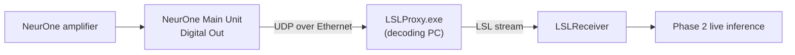

# Hardware

How live EEG gets from the amplifier into the app during Phase 2, and the
contract the software expects from it.



The amplifier does not connect to the app directly. It feeds the NeurOne Main
Unit, whose **Digital Out** sends the data as UDP packets over an Ethernet link
to the decoding PC, where `LSLProxy.exe` turns them into an LSL stream that
`LSLReceiver` consumes.

---

## Acquisition setup

The online setup uses two machines connected to two separate Ethernet ports on
the NeurOne Main Unit (not to each other):

- The **acquisition PC** runs the NeurOne software and the stimulus program
  (PsychoPy).
- The **decoding laptop** runs this app.

The amplifier records **64 EEG channels plus 1 trigger channel at 1000 Hz**. The
EEG electrodes follow the `easycap-M1` layout.

NeurOne does not speak LSL natively. Its real-time output is a proprietary
protocol called **DigiOut**, which sends raw UDP packets in a binary format.

---

## The LSLProxy bridge

Bittium provides `LSLProxy.exe`, which receives NeurOne's DigiOut UDP packets and
republishes them as an LSL stream. It is bundled at `tools/lslproxy/` with its
DLLs, and configured by a two-line `Settings.ini`:

```ini
port=50000
stream_name=NeuroneStream
```

Two things the proxy does that the rest of the app depends on:

- It applies the amplifier's AC scaling (**divides by 20**) before publishing, so
  the LSL stream carries values in **microvolts**.
- It embeds **no channel metadata** — the stream has no channel names.

The app manages this process through `LslProxySource`
(`src/backend/online_phase/stream_source.py`). It is **Windows-only** (the bundled
proxy is a `.exe`), and `start()` is idempotent: it clears any orphaned instance,
launches the proxy with a hidden console window, verifies it did not die on
startup, and registers cleanup. Because it will not relaunch a live process,
stream discovery and the following run share one proxy without churning the
amplifier connection. `AppSession` owns its lifetime and only tears it down when
the Phase 2 screen closes.

`LslProxySource` is one implementation of the `StreamSource` protocol
(`start` / `stop` / `is_running`); an offline recording replay implements the same
protocol, so the receiver stays a pure consumer either way.

---

## Network and protocol setup

Two one-time steps have to be right before any of this works: the network link
and the NeurOne output settings.

**Network.** Connect an Ethernet cable between the NeurOne Digital Out and the
decoding PC, and set the PC's IP address to **192.168.200.240**. Disable the
firewall on that link.

**NeurOne Real-time Out.** In NeurOne, open Protocol → the Real-time Out tab and:

- Enable **Digital** and add the desired inputs.
- Target IP Address: **192.168.200.240**
- Target UDP port: **50000**
- Packet Frequency: **1000**
- Check **"Send Packets MeasurementStart and MeasurementEnd"**.

The Target UDP port and the proxy's `Settings.ini` port must match (both 50000).

**Order at runtime.** The proxy must be publishing before the measurement starts.
The app starts the proxy for you when the Phase 2 screen opens (`LslProxySource`),
so the operator just starts the NeurOne measurement afterwards. To check the link
by hand, run `LSLProxy.exe` directly and start a measurement: its console should
change to `MEASUREMENTSTART`, a block size, and a trigger line
(`Triggers: 0 (A), 0 (B), 0 (8-bit)`).

---

## The stream contract

`LSLReceiver` (`src/backend/online_phase/lsl_receiver.py`) is a pure consumer: it
resolves the stream and pulls from it. It resolves by type `EEG` and name
`NeuroneStream`, and validates on connect, failing fast on a mismatch:

- exactly **1000 Hz**, and
- exactly **65 channels** (64 EEG + 1 trigger).

1000 Hz is the rate the app currently supports — the receiver enforces it. The
rate is set on the NeurOne side (the Packet Frequency in the Real-time Out
settings, below); running at a different rate is possible on the hardware but
would require matching changes in the app, so it is fixed at 1000 Hz for now.

Because the stream carries no channel labels, the electrode-to-position mapping is
**not** read from the stream — it is applied positionally in preprocessing
(`src/backend/core/preprocessing_constants.py`): the `easycap-M1` montage, with
the EMG channel dropped and `HEGOC` renamed to `HEOG`.

### Units on the wire

The stream is in microvolts, but the offline pipeline and the trained decoder are
calibrated in **SI volts** (MNE loads recordings in volts). `OnlinePreprocessor`
converts once at ingestion with a single constant:

```python
LSL_TO_SI_SCALE = 1e-6  # microvolts -> volts
```

Without this the features arrive ~1e6× too large and `predict_proba` saturates to
0/1. If the proxy is ever reconfigured to advertise a different unit, this one
constant is the only thing that changes.

---

## Triggers

Event markers are parallel-port codes emitted by the stimulus program. There is
**no separate marker stream** — the codes ride inside the EEG stream on the
trigger channel (channel 65, index 64), one value per sample.

NeurOne packs several trigger sources into that integer using a fixed bit layout;
the parallel-port code sits in **bits 8–15**. The app decodes it with:

```python
trigger_code = (int(raw_value) >> 8) & 0xFF
```

`LSLReceiver` splits the trigger channel off each pulled chunk and emits a marker
on every **rising edge** (a non-zero code that differs from the previous sample's
code), as `(sample_index, code)`. What each code *means* is experiment-specific
and defined in `markers_mapping` in `experiment_config.yaml`; the receiver emits
every edge, and only configured codes get named downstream.

For offline training the same events come from the BrainVision recording instead:
they are read natively from the `.vmrk` marker file, so the offline and online
paths decode the same logical triggers from two different transports.
