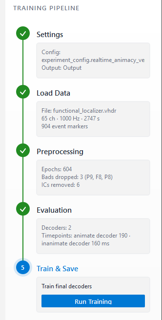

# Application User Manual

A step-by-step guide to running an experiment with the app, across the two
phases: **Phase 1 (offline)** trains a decoder from a recording, and **Phase 2
(online)** runs it live against an LSL stream. For install and run instructions
see the [README](../../README.md).

<!-- SCAFFOLD NOTE: this file is being rebuilt into a task-oriented operating
manual. Existing screenshots and captions are repositioned under the new
outline. Each section carries a TODO describing what still needs to be written.
Fill order: top to bottom, one section per commit. -->

## Overview

The app runs an experiment in two phases:

- **Phase 1 (offline):** you load a recording of the functional-localizer stage,
  and the app walks you through preprocessing, evaluation, and training to
  produce a decoder. It is operator-driven and takes a few minutes per run.
- **Phase 2 (online):** you run that decoder against a live LSL stream and watch
  its output in real time. It runs continuously until you stop it.

## Before you start

You will need:

- **An experiment configuration** (`experiment_config.yaml`) describing your
  decoders, trigger mapping, and seed. See the README
  [Configuration](../../README.md#configuration) section for the schema.
- **A functional-localizer recording** in BrainVision format (`.vhdr` + `.vmrk` +
  `.eeg`), used to train the decoder in Phase 1.
- **An LSL stream** for the live phase. This is either the hardware stream
  published by LSLProxy (Windows only) or a replayed recording used for testing.
- **An output directory** where the run's results are written. You choose it on
  the Settings screen.

The app must be installed and running first. See the README for
[install and run instructions](../../README.md#getting-started).

## Launch

When you start the app it opens on a welcome screen with two entry points.

- **Start New Training** runs the full Phase 1 pipeline from scratch. Choose this
  when you have a new functional-localizer recording to train a decoder from.
- **Open Live from Existing Output** skips straight to Phase 2 against a folder a
  previous run already trained into (one that already holds a
  `models/decoder_pipeline.joblib`). Choose this to run live inference again
  without retraining.

## Phase 1: Training (offline)

Training runs as a fixed five-step sequence: **Settings**, **Load Data**,
**Preprocessing**, **Evaluation**, and **Train & Save**. Together they clean the
recording and fit one decoder per task, producing the decoder artifact.

The panel on the right side of every Phase 1 screen (the **Training Pipeline**)
is the navigation for these steps. It highlights the step you are on and holds
that step's action button (for example **Continue** or **Run Evaluation**). When
a step finishes it is marked complete with a short summary of its result, and the
panel advances to the next step. You move through the steps in order.

### Pipeline Settings

The first screen loads your experiment and shows the settings the run will use.

- **Load the config file** and **choose an output directory** with the two
  pickers at the top. Both must be set before you can continue. The output
  directory is where all of this run's data is written, see
  [Output files](#output-files).
- The screen then lists, read-only, every setting this run will use: the fixed
  preprocessing recipe and the model-evaluation settings (model,
  cross-validation folds, and the decoders) read from your config. Review them
  carefully. Settings cannot be edited here, so if anything needs changing, edit
  the config file and load it again.
- When the settings are correct, press **Continue** to move on to Data Loading.

### Data Loading

Select the folder holding the recording, then load it.

- **Pick the recording folder** with the file picker. The app reads the
  BrainVision recording from it (the `.vhdr` header together with its `.vmrk`
  markers and `.eeg` data).
- Press **Load & Continue** to load the recording into the session. The sidebar
  then summarizes what was loaded: the file, its channel count, sampling rate,
  duration, and the number of event markers found.

<!-- TODO: consider a troubleshooting note here for load failures (the
BrainVision header/filename mismatch, tracked as an optional item in the
documentation plan). -->

### Preprocessing

This step cleans the recording. You start it from a single control, and it runs
filtering, bad-channel handling, ICA, and epoching. It pauses twice for your
input and takes a few minutes.

> **Important:** closing an MNE window commits your selection and preprocessing
> continues immediately. The window cannot be reopened, so finish marking or
> toggling before you close it.

**Mark bad channels.** MNE's interactive browser opens and shows the raw traces.
Click any channels you want to exclude to mark them, then close the window to
continue.

**Review ICA components.** After ICA runs, its components open as a grid of
topomaps, each labelled with its ICLabel category and confidence, with the likely
artifacts already selected. Click a component's topomap to open its properties
window for a closer look at its topography, power spectrum, and activity over
time. Toggle which components to remove, then close the window to continue.

**Completion.** When preprocessing finishes, the screen summarizes the cleaned
data: the epochs retained per class and the number of ICA components removed.

### Model Evaluation

This step runs cross-validation to measure how each decoder performs across the
epoch, and it is where you set the timepoint each decoder will use for live
inference.

<!-- TODO (asset): add a "Run Evaluation" ready-state screenshot here (like the
preprocessing and train ready screens), numbered to sort before
05a-eval-progress. -->

Press **Run Evaluation** in the sidebar to start. Cross-validation runs across
the decoders one at a time. The progress bar advances in one jump per decoder
completed rather than filling smoothly, and an estimated time remaining appears
after the first decoder finishes.

When it finishes, the **Summary tab** shows an overlay of every decoder's AUC
across epoch time, plus a roster with one row per decoder. Each row has its own
timepoint field (pre-filled with that decoder's suggested peak), a readout of its
AUC at that timepoint, and a **Confirm** button.

Each decoder also has its own tab, showing its AUC-over-time curve alongside its
temporal-generalization matrix (train time by test time). You set a decoder's
timepoint either by typing it in its field on the Summary tab or by clicking the
curve on that decoder's own tab. The two stay in sync, so a selection made on an
individual tab updates the Summary roster.

Confirm each decoder from the Summary tab. Once every decoder is confirmed, you
can continue to Train & Save.

### Train & Save

This final step fits each decoder at its confirmed timepoint and saves the
result. Press the play button to run it.

Training fits one classifier per decoder at its confirmed timepoint and writes
the decoder bundle to `models/decoder_pipeline.joblib` in your output directory
(see [Output files](#output-files)). When it finishes, the screen shows a spatial
topomap for each decoder.

The saved bundle carries not only the trained decoders but the preprocessing used
to train them (the fixed filtering recipe, the channels you marked bad, and the
ICA solution), frozen together. Phase 2 loads this bundle and cleans the live
stream exactly as the training data was cleaned, so the two cannot diverge. This
preprocessing is fixed at training time and cannot be changed during the live
phase.

From here you can go live to run it against a stream.

## Phase 2: Live inference (online)

<!-- TODO (Phase 2 intro): one line framing Phase 2 as running the trained decoder
against a live LSL stream in real time. -->

### Entering live

<!-- TODO: the two ways in - the Go Live handoff at the end of Phase 1, or "Open
Live from Existing Output" from the welcome screen against a prior run's folder. -->

_To be written._

### Discover and select the stream

*Available LSL streams on the network are discovered automatically and presented to choose from (here the replayed `NeuroneStream`).*

<!-- TODO: action (streams are discovered, pick one), the DECISION of the decode
target, and the replay-vs-hardware distinction (cross-link Before you start /
Troubleshooting). -->

### Reading the live screen

*The full live screen before inference starts: status header, decoder and decision-settings sidebar, and the empty decision, probability, and event-locked regions awaiting a stream.*

*The full live screen during inference - everything together: status and latency header, decision tiles, streaming probability chart, and event-locked view.*

*The live header shows the inference status, the selected decode target, and a latency readout (rolling ~1 s average): Pipeline is the compute time to process one micro-batch (preprocessing plus inference), while E2E is the end-to-end latency from a sample arriving to its prediction.*

*The decision tiles above the live probability chart: each decoder's class probability streams in real time, and a tile lights up in the decoder's colour when it latches over threshold.*

*An event-locked view that freezes the decoder outputs around each trigger event, with controls to browse the captured history.*

<!-- TODO: walk through reading each region - header (status, target, the two
latency numbers), decision tiles (latch over threshold), probability chart, and
the event-locked view. Keep it about interpretation, not internals. -->

### Controls

*The live control sidebar: toggle each decoder's visibility and set the decision threshold and sustain length. The Start/Halt button sits at its foot.*

<!-- TODO: the operator controls - decoder visibility, decision threshold, sustain
length, and Start/Halt. Explain what threshold and sustain length do to the
decision tiles. -->

## Output files

<!-- TODO (Output files): what a run produces and which files matter to the user.
Verified against SessionPaths + session_logger.py:
- Phase 1: models/decoder_pipeline.joblib (the artifact Phase 2 loads), epochs/,
  evaluation/, experiment_config.yaml (copy of the run's config).
- Phase 2, per run under phase2_live/<timestamp>/: predictions.csv, markers.csv,
  decisions.csv, manifest.json, predictions.npz.
Include the directory tree and a short "how to use it" per file. -->

_To be written._

## Troubleshooting

<!-- TODO (Troubleshooting): fill with known gotchas -
- no LSL stream found / the live path is Windows-only (LSLProxy)
- replay vs hardware stream setup
- optional: BrainVision header/filename mismatch (tracked in the documentation plan)
- (add others as they come up)
-->

_To be written._
