# Application User Manual

A step-by-step guide to running an experiment with the app, across the two
phases: **Phase 1 (offline)** trains a decoder from a recording, and **Phase 2
(online)** runs it live against an LSL stream. For install and run instructions
see the [README](../../README.md).

<!-- SCAFFOLD NOTE: this file is being rebuilt into a task-oriented operating
manual. Existing screenshots and captions are repositioned under the new
outline. Each section carries a TODO describing what still needs to be written.
Fill order: top to bottom, one section per commit. -->

## Overview

The app runs an experiment in two phases:

- **Phase 1 (offline):** you load a recording of the functional-localizer stage,
  and the app walks you through preprocessing, evaluation, and training to
  produce a decoder. It is operator-driven and takes a few minutes per run.
- **Phase 2 (online):** you run that decoder against a live LSL stream and watch
  its output in real time. It runs continuously until you stop it.

## Before you start

<!-- TODO (Before you start): the prerequisites a user needs in hand:
- a valid experiment_config.yaml (link to README Configuration)
- a BrainVision functional-localizer recording (.vhdr + .vmrk + .eeg) for training
- for live: either the hardware LSL stream (Windows + LSLProxy) or a replay source
- where output goes (the output directory chosen on Settings)
Point to the README for install/run rather than repeating it. -->

_To be written._

## Launch

*The launcher offers two entry points: start a new training run from scratch, or open live inference directly from a folder a previous run already trained into.*

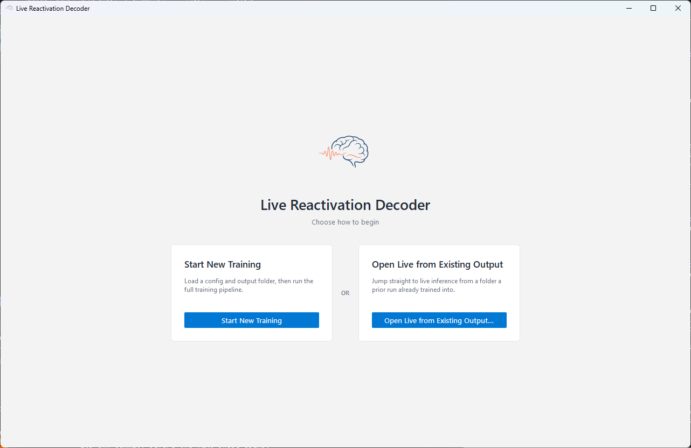

<!-- TODO (Launch): describe the two entry points as user choices - when to pick
"Start New Training" vs "Open Live from Existing Output" (the latter needs a
folder a prior run already trained into). -->

## Phase 1: Training (offline)

<!-- TODO (Phase 1 intro): one line framing Phase 1 as the operator-driven
sequence Settings -> Load Data -> Preprocess -> Evaluate -> Train, producing the
decoder artifact. -->

### Pipeline Settings

*Loads the experiment configuration and output directory, then displays the fixed preprocessing and model-evaluation settings for review before the run begins.*

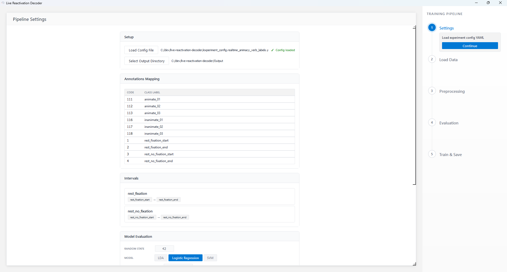

<!-- TODO: action (load config + choose output dir), what to review (the fixed
preprocessing recipe and the decoder/eval settings read from config), and how to
proceed (Continue enables once both paths are set). -->

### Data Loading

*Selects the recording folder and loads the BrainVision `.vhdr` file into the session.*

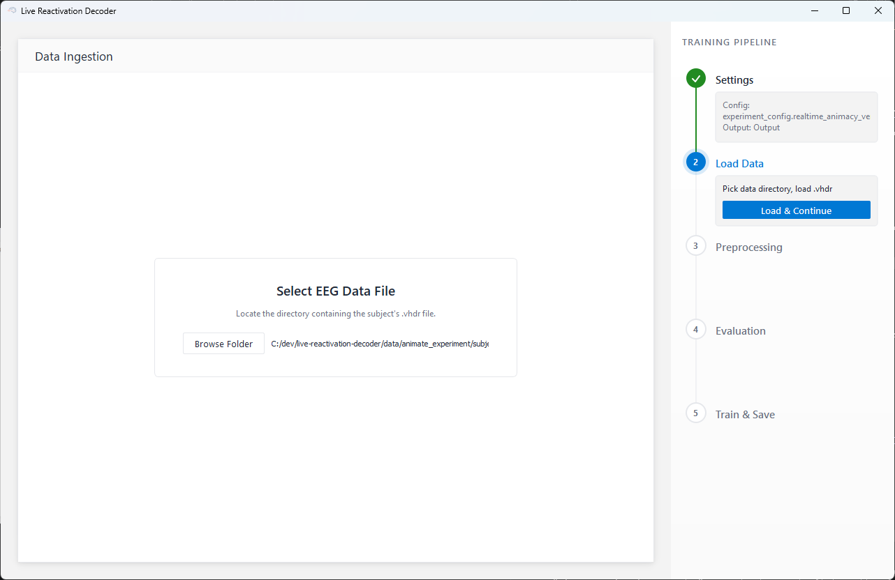

<!-- TODO: action (pick the recording folder), what is loaded (BrainVision triplet,
markers from .vmrk), and the known BrainVision header/filename mismatch gotcha
(cross-link Troubleshooting). -->

### Preprocessing

*The preprocessing step starts from a single control, then runs filtering, bad-channel marking, ICA, and epoching automatically.*

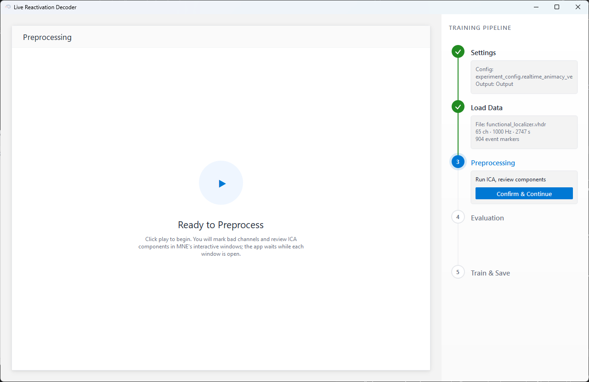

*MNE's interactive browser, where the operator inspects the raw traces and marks noisy channels to exclude.*

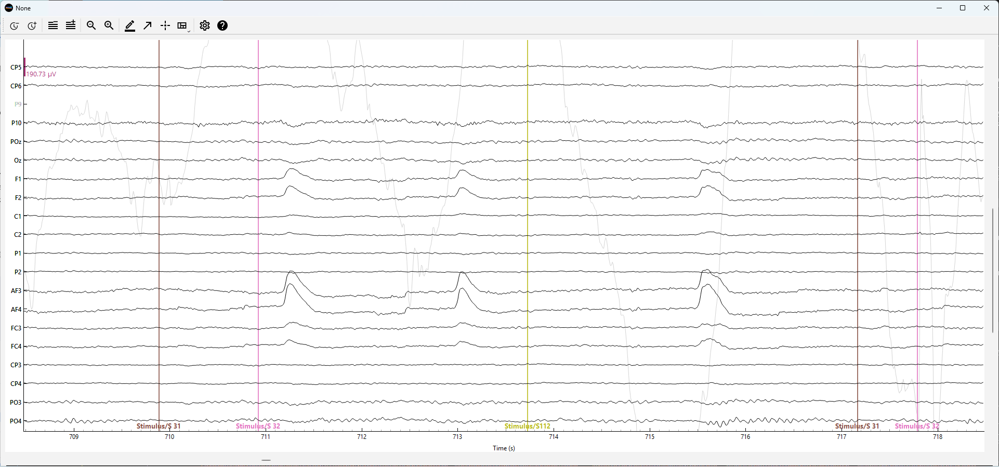

*The full set of ICA components shown as topomaps, each labelled with its ICLabel category and confidence; the operator toggles which components to remove.*

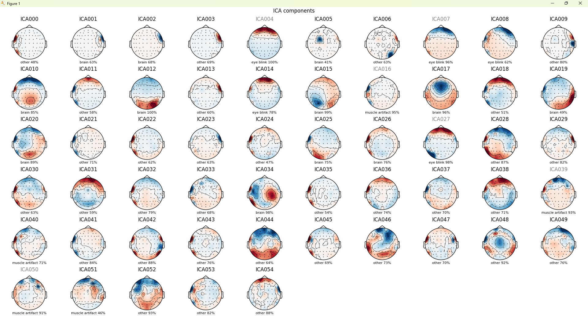

*A summary of the cleaned data: epochs retained per class and the number of ICA components removed.*

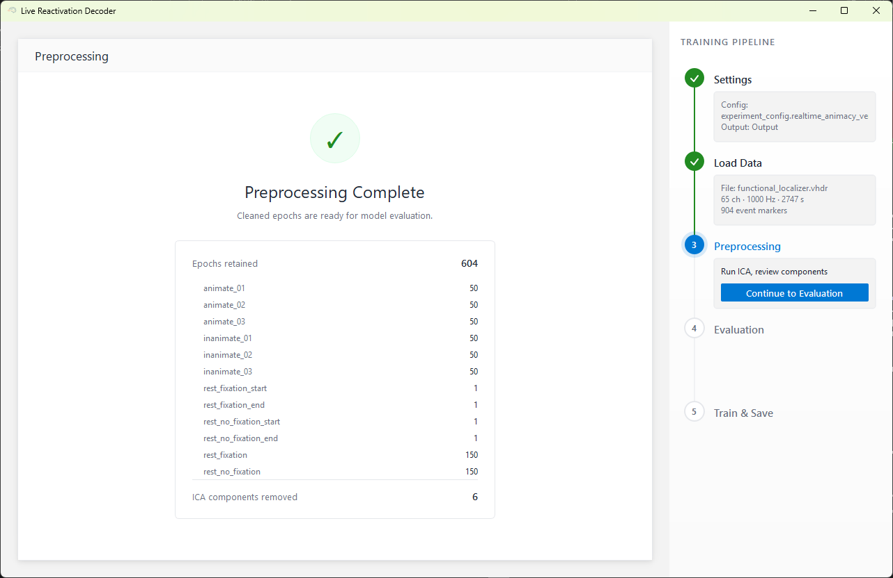

<!-- TODO (mechanics only): the two operator actions - marking bad channels in
MNE's browser, and reviewing/toggling the ICLabel-suggested ICA components. Note
the ~5 min wait, that MNE windows pop modally and you close them to continue, and
what the completion summary reports (epochs retained per class, components
removed). Describe the mechanics, not how to judge a channel/component. -->

### Model Evaluation

*Cross-validation runs across the decoders one at a time - here the animate decoder is complete and the inanimate decoder is running.*

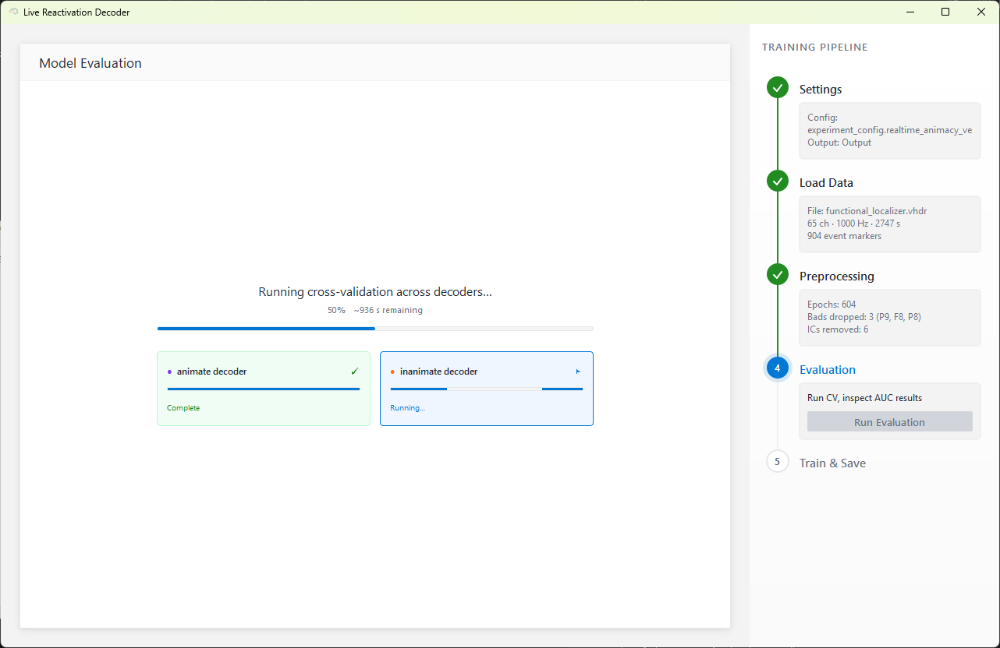

*The summary tab: AUC across epoch time for all decoders, where clicking the curve selects the timepoint used for inference.*

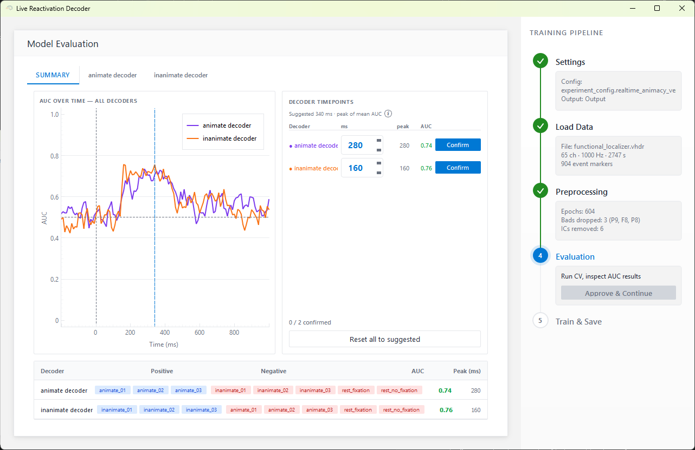

*Each trained decoder also gets its own tab, presenting that decoder's AUC-over-time curve alongside its temporal-generalization matrix (train × test).*

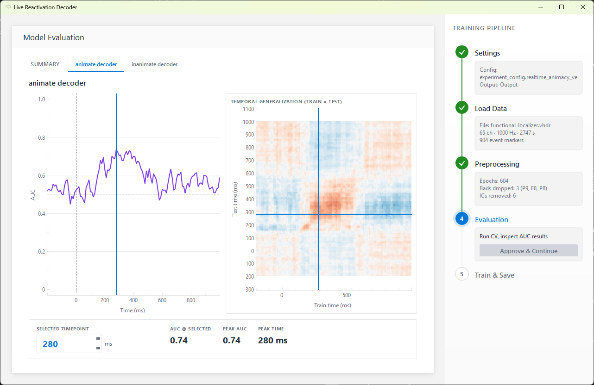

<!-- TODO (mechanics only): the operator picks the inference timepoint by clicking
the AUC curve on the summary tab, and confirms it before training. Describe what
the plots show (per-decoder AUC-over-time and the TGM) and the click-to-select
mechanic, not how to judge which timepoint is best. -->

### Train & Save

*The train step ready to run, before the final decoders are fit at the confirmed timepoints.*

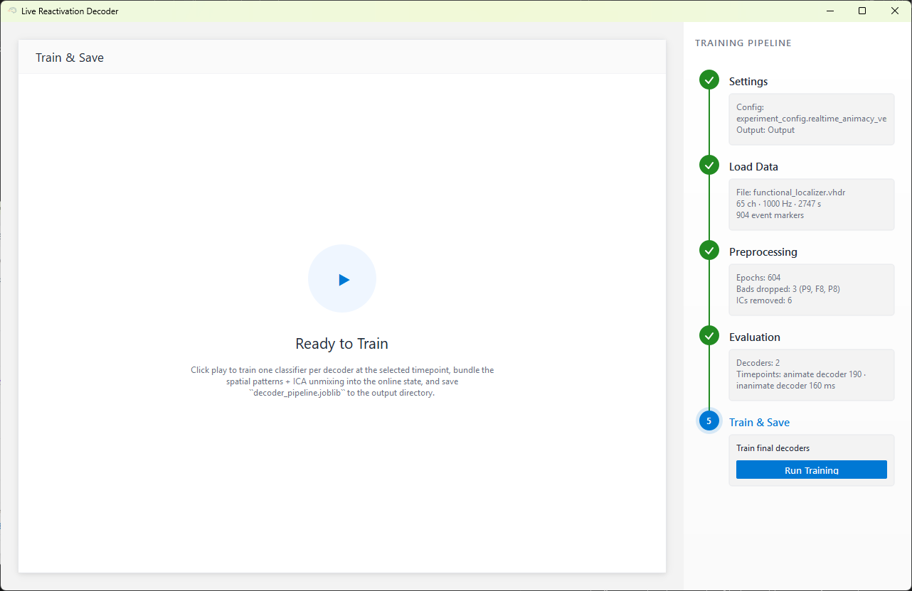

*Trains the final decoders at the selected timepoint and saves the pipeline artifact, with a spatial topomap for each decoder.*

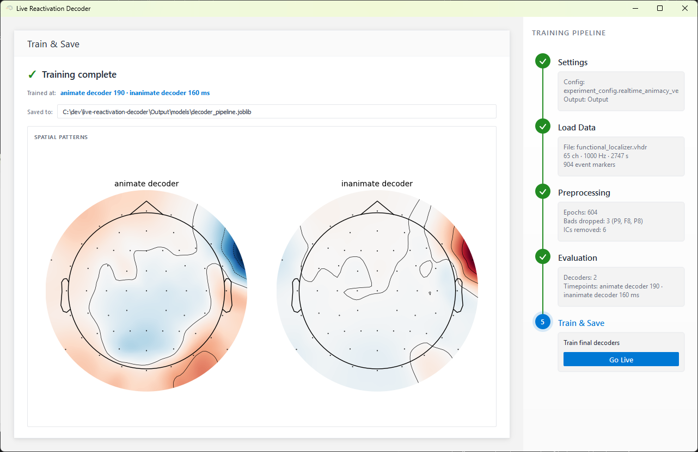

<!-- TODO: action (train), what is produced (decoder_pipeline.joblib, cross-link
Output files), and how to read the spatial topomaps as a sanity check. Note the
handoff to Phase 2 (Go Live). -->

## Phase 2: Live inference (online)

<!-- TODO (Phase 2 intro): one line framing Phase 2 as running the trained decoder
against a live LSL stream in real time. -->

### Entering live

<!-- TODO: the two ways in - the Go Live handoff at the end of Phase 1, or "Open
Live from Existing Output" from the welcome screen against a prior run's folder. -->

_To be written._

### Discover and select the stream

*Available LSL streams on the network are discovered automatically and presented to choose from (here the replayed `NeuroneStream`).*

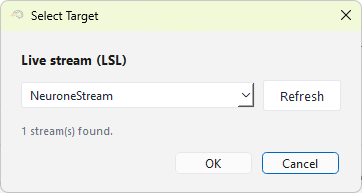

<!-- TODO: action (streams are discovered, pick one), the DECISION of the decode
target, and the replay-vs-hardware distinction (cross-link Before you start /
Troubleshooting). -->

### Reading the live screen

*The full live screen before inference starts: status header, decoder and decision-settings sidebar, and the empty decision, probability, and event-locked regions awaiting a stream.*

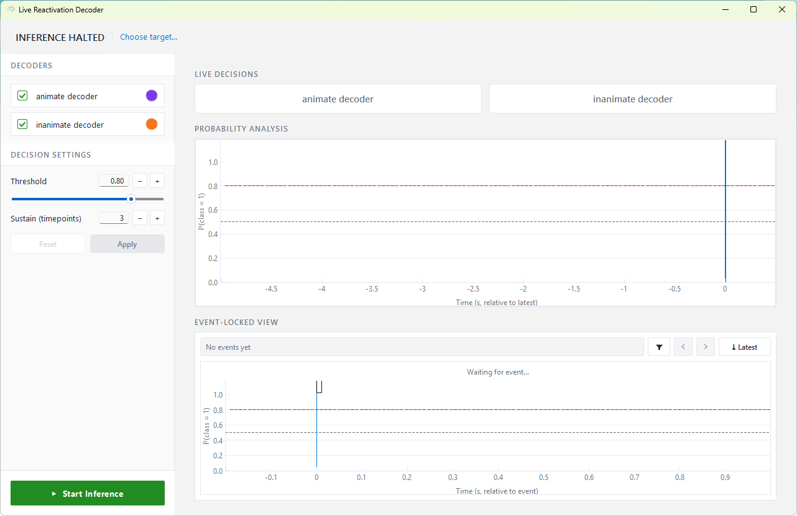

*The full live screen during inference - everything together: status and latency header, decision tiles, streaming probability chart, and event-locked view.*

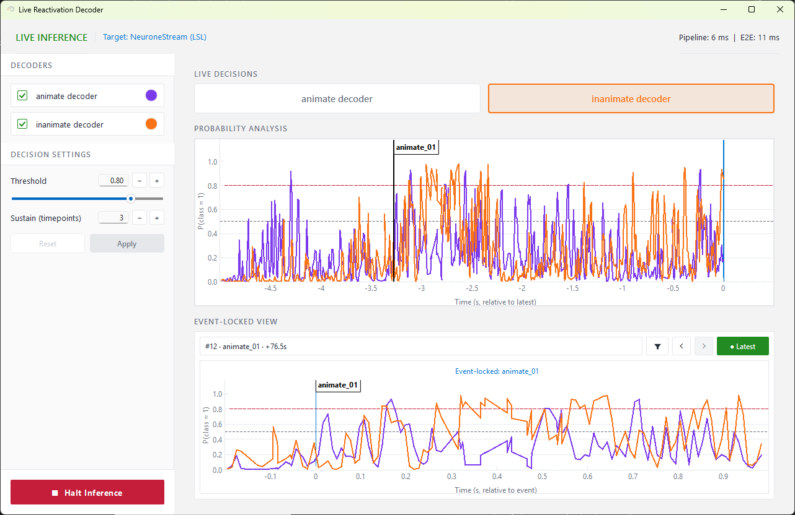

*The live header shows the inference status, the selected decode target, and a latency readout (rolling ~1 s average): Pipeline is the compute time to process one micro-batch (preprocessing plus inference), while E2E is the end-to-end latency from a sample arriving to its prediction.*

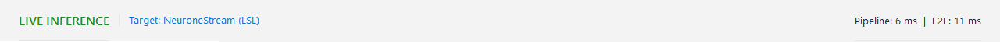

*The decision tiles above the live probability chart: each decoder's class probability streams in real time, and a tile lights up in the decoder's colour when it latches over threshold.*

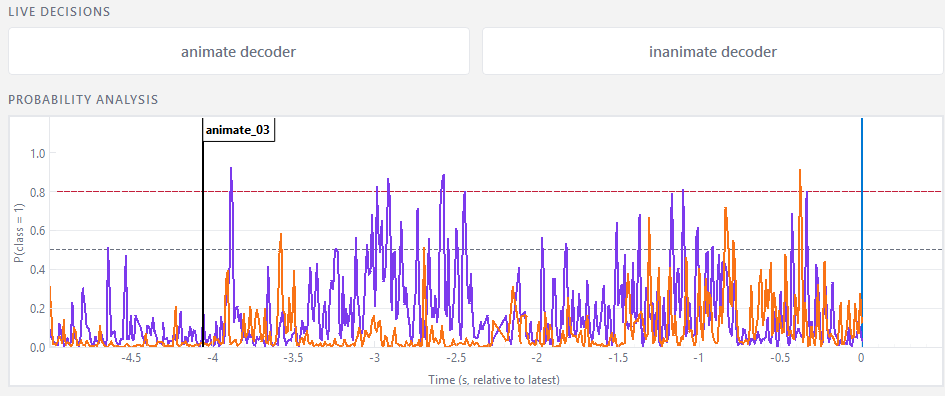

*An event-locked view that freezes the decoder outputs around each trigger event, with controls to browse the captured history.*

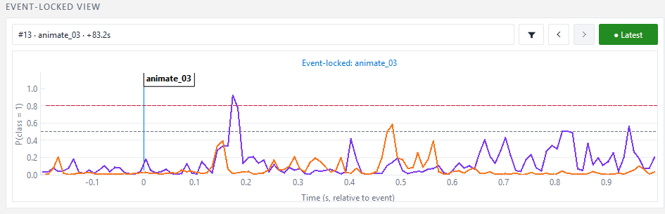

<!-- TODO: walk through reading each region - header (status, target, the two
latency numbers), decision tiles (latch over threshold), probability chart, and
the event-locked view. Keep it about interpretation, not internals. -->

### Controls

*The live control sidebar: toggle each decoder's visibility and set the decision threshold and sustain length. The Start/Halt button sits at its foot.*

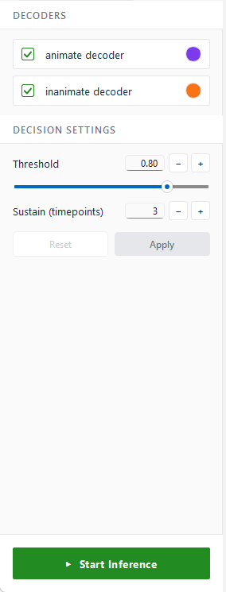

<!-- TODO: the operator controls - decoder visibility, decision threshold, sustain
length, and Start/Halt. Explain what threshold and sustain length do to the
decision tiles. -->

## Output files

<!-- TODO (Output files): what a run produces and which files matter to the user.
Verified against SessionPaths + session_logger.py:
- Phase 1: models/decoder_pipeline.joblib (the artifact Phase 2 loads), epochs/,
  evaluation/, experiment_config.yaml (copy of the run's config).
- Phase 2, per run under phase2_live/<timestamp>/: predictions.csv, markers.csv,
  decisions.csv, manifest.json, predictions.npz.
Include the directory tree and a short "how to use it" per file. -->

_To be written._

## Troubleshooting

<!-- TODO (Troubleshooting): the known gotchas -
- BrainVision header/filename mismatch (data defect, surfaces as FileNotFoundError)
- no LSL stream found / the live path is Windows-only (LSLProxy)
- replay vs hardware stream setup
- (add others as they come up)
-->

_To be written._
